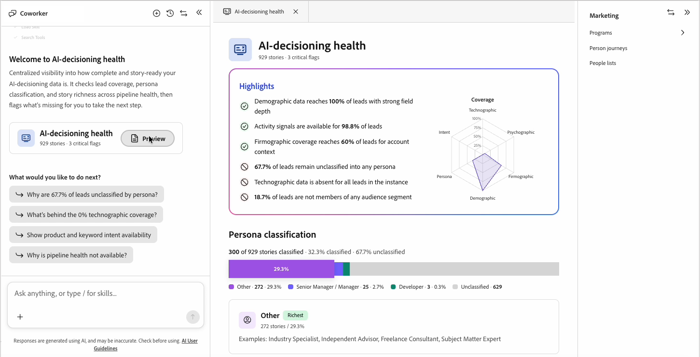

# IA-Decisioning health

El estado de decisiones de IA comprueba los datos que alimentan la personalización en [!DNL Adobe Marketo Optimizer]. Informa sobre la cobertura de los posibles clientes, la clasificación personal y la riqueza de historias en las categorías demográfica, firmográfica, tecnográfica y psicográfica. A continuación, marca los datos que faltan para identificar por dónde empezar.

Utilice el estado de toma de decisiones de IA para ver qué datos fluyen desde [!DNL Marketo Engage] y dónde existen espacios. Cerrar esos huecos mejora la forma en que [AI Decisioning](./ai-decisioning.md) puntúa y enruta a cada persona.

## Abrir estado de toma de decisiones de IA {#open}

Abra el informe desde la página de inicio o desde el chat de Coworker.

* En la página _Página de inicio_, seleccione la tarjeta **[!UICONTROL Estado de toma de decisiones por IA]** en la fila Acceso rápido. La tarjeta encabeza la fila y muestra el volumen de la historia y el progreso de clasificación de personalidades, como 929 historias, el 32 % de personalidades clasificadas.
* En el cuadro de chat de Compañero de trabajo, pregunte sobre sus datos de personalización directamente o escriba `/` y seleccione **[!UICONTROL estado de decisiones de IA]**.

{width="600"}

Ambas rutas abren el informe en el espacio de trabajo de Compañeros.

## Mensajes de bienvenida y seguimiento de chat {#chat-welcome}

Al abrir el estado de toma de decisiones de IA desde el chat, se muestra un mensaje de bienvenida _[!UICONTROL *Bienvenido al estado de toma de decisiones de IA]_, un resumen de las comprobaciones de informes y una tarjeta para abrir el informe completo.

Debajo de la tarjeta, en _[!UICONTROL ¿Qué desea hacer a continuación?]_, el estado de toma de decisiones de IA sugiere mensajes de seguimiento basados en las brechas específicas de sus propios datos. Por ejemplo, si el 67,7 % de los posibles clientes carecen de una clasificación de persona, un mensaje sugerido dirá _¿Por qué el 67,7 % de los posibles clientes no están clasificados por persona?_ Seleccione un mensaje sugerido o haga su propia pregunta para obtener una respuesta directa sin salir del chat.

{width="800" zoomable="yes"}

## Resumen del informe {#report-overview}

El informe de área de trabajo se abre con una llamada de **[!UICONTROL resaltados]** que enumera las áreas más fuertes y débiles de los datos en un lenguaje sencillo, como _Los datos demográficos alcanzan el 100% de los posibles clientes con una profundidad de campo sólida_ o _el 67,7% de los posibles clientes permanecen sin clasificar en ningún perfil_. Una marca de verificación marca un resultado correcto y un círculo con barras diagonales marca un espacio.

Junto a lo más destacado, un gráfico radial traza la **[!UICONTROL cobertura]** general en seis dimensiones: demográfica, firmográfica, tecnográfica, psicográfica, personal e intención. Un área sombreada más grande significa una cobertura más amplia.

## Clasificación de persona {#persona-classification}

La sección **[!UICONTROL Clasificación de persona]** muestra cuántas de tus historias se clasifican en una persona, por ejemplo: _300 de 929 historias clasificadas · 32,3% clasificadas · 67,7% no clasificadas_. Una barra apilada divide las historias clasificadas por persona, con una leyenda que muestra el recuento de historias y el porcentaje de cada una.

Seleccione un segmento de personalidad para abrir una tarjeta de detalles con títulos de trabajo de ejemplo para esa persona. Por ejemplo, el segmento **[!UICONTROL Otros]** podría mostrar: _272 artículos / 29,3%_, con ejemplos como Especialista del sector, Asesor independiente, Consultor independiente y Experto en la materia.

## Cobertura {#coverage}

La sección **[!UICONTROL Cobertura]** enumera cinco categorías de datos: demográficos, firmográficos, tecnográficos, psicográficos, e intención y actividad. Cada categoría muestra el porcentaje de historias con al menos un atributo disponible en esa categoría.

Seleccione una categoría para expandirla y, a continuación, elija una de las dos pestañas:

* **[!UICONTROL Atributos]**: atributos agrupados por tipo, como Detalles personales o Ubicación en el área demográfica. Cada atributo muestra cuántos artículos tienen un valor para él, por ejemplo: `firstName (906 stories)`.
* **[!UICONTROL Indicadores]** - Huecos específicos de esa categoría o _No hay indicadores abiertos en esta categoría_ cuando la cobertura es correcta.

Utilice el campo de búsqueda situado encima de la lista de categorías para ir directamente a una categoría o atributo por nombre.

{width="800" zoomable="yes"}

## Indicadores {#flags}

La sección **[!UICONTROL Marcas]** al final del informe enumera todas las brechas encontradas en todas las categorías, clasificadas por gravedad:

* **[!UICONTROL Esferas críticas]**: las brechas que bloquean una capacidad directamente, como la _cobertura tecnológica es del 0% en todos los posibles clientes_.
* **[!UICONTROL Observar]**: las brechas que reducen la eficacia pero no bloquean una capacidad, como la _cobertura psicográfica alcanza solo el 7,2% de los posibles clientes_.

Filtre la lista por gravedad y, a continuación, seleccione un indicador para expandirla y lea una explicación de una frase de su impacto en la empresa, por ejemplo: _Los posibles clientes no clasificados no pueden entrar en recorridos específicos de la persona ni recibir mensajes adaptados a funciones, lo que reduce la relevancia de la campaña y las tasas de conversión._

{width="800" zoomable="yes"}

## Accedido recientemente {#recently-accessed}

Si abre el estado de toma de decisiones de IA y luego se aleja, vuelve a aparecer en **[!UICONTROL Acceso reciente]** en el área de trabajo vacía, por lo que puede volver al informe sin volver a la página principal.

{width="500"}

>[!BEGINSHADEBOX]

Las mejoras planificadas para el estado de la toma de decisiones de IA incluyen:

* Una entrada específica en el catálogo de aptitudes de Coworker.
* Acciones guiadas de &quot;preguntar cómo&quot; que le guían a través del arreglo de una marca.
* Una pestaña dedicada de pasos siguientes.

>[!ENDSHADEBOX]
