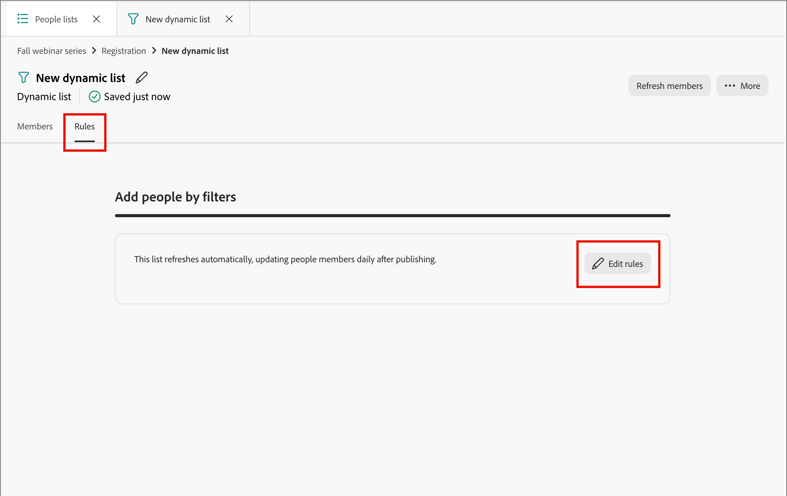

# Listas de personas

En [!DNL Adobe Marketo Optimizer], las listas de personas son los contenedores de audiencia de nivel de persona para la segmentación y la entrada de recorrido de personas, con listas dinámicas para la calificación en vivo basada en reglas y listas estáticas para la membresía fija o administrada por recorrido.

## Acceso y exploración de listas de personas {#access-browse}

1. En el panel de navegación izquierdo, expanda **[!UICONTROL Administración de mercadotecnia]**.

1. A la derecha de la lista de recursos de **[!UICONTROL Marketing]**, seleccione **[!UICONTROL Listas de personas]**.

   {width="800" zoomable="yes"}

Hay dos fichas para la página donde puede ver y administrar **[!UICONTROL listas dinámicas]** y **[!UICONTROL listas estáticas]**. Haga clic en la pestaña para cambiar la vista de lista entre los dos tipos.

Puede escribir texto en la herramienta _Buscar_ situada en la parte superior de la lista para filtrar la lista mostrada por nombre. Utilice las herramientas de lista para personalizar la lista mostrada:

* Haga clic en el icono _Personalizar tabla_ (  ) para controlar las columnas mostradas.
* Haga clic en el icono _Restablecer columnas_ (  ) para restablecer los anchos de columna.

Desde este espacio también puede:

* Creación de nuevas listas dinámicas y estáticas
* Listas de acceso para revisar la pertenencia actual
* Aplicar filtros de pertenencia

<!--
## Audience Hub

The AI Audience Hub is a centralized, AI-driven starting point for all audience-related capabilities across [!DNL Adobe Marketo Optimizer]. It is designed to accelerate first-time user success while progressively unlocking advanced intelligence, insights, and control for returning and power users.

The Hub acts as:

* A guided starting point for discovering, creating, and refining person lists, account lists, and buying groups

* A visibility layer for audience health, coverage, overlap, engagement patterns, and AI-driven insights

* A control center for audience governance, optimization, reuse, and readiness for activation across journeys and sales workflows

### High level structure

Prompt-based starting point - Quick Start prompts and freeform input to help users discover, create, or optimize audiences.

1. AI insights feed - Surfaces key audience signals such as overlap, gaps, saturation risk, and optimization opportunities.

1. Adaptive audience library - A personalized view of people lists, account lists, and buying groups that adapts based on usage, relevance, and activation.

1. Optimization and arbitration nudges - Guides users to refine, split, or reuse audiences before activation.

1. Audience visibility and reporting - High-level insight into audience health, engagement patterns, and usage across active journeys.

### Empty and Error States (High-Level)

No audiences / no data - Show Quick Start prompts to help first-time users create or import person lists

Low data or incomplete audience - Explain what's missing (e.g., insufficient contacts, missing persona coverage, or low engagement data) and suggest next steps.

AI insights unavailable - Provide a graceful fallback with a clear explanation, so users understand why insights aren't shown and what actions they can take manually.
-->

## Creación de una lista de personas {#create-people-list}

1. Haga clic en **[!UICONTROL Crear lista]** en la parte superior derecha de la página _[!UICONTROL Listas de personas]_.

1. En el cuadro de diálogo, seleccione un programa como **[!UICONTROL Principal]** para la lista.

1. Escriba un **[!UICONTROL Nombre]** (obligatorio) y una **[!UICONTROL Descripción]** (opcional) para la lista.

1. Elija la lista **[!UICONTROL Type]**:

   * [**[!UICONTROL Estático]**](#static-lists): la pertenencia se determina mediante filtros calificadores evaluados al crear la lista. La inscripción a la lista no se actualiza a menos que califique o descalifique manualmente registros.
   * [**[!UICONTROL Dinámico]**](#dynamic-lists): la pertenencia se determina dinámicamente mediante filtros calificadores. La inscripción a la lista se actualiza automáticamente.

   {width="450"}

1. Haga clic en **[!UICONTROL Crear]**.

>[!NOTE]
>
>Eliminar y duplicar no son compatibles actualmente con las listas de personas en esta versión de Beta.

## Listas estáticas {#static-lists}

La pertenencia a una lista estática se define mediante filtros simples que hacen referencia a los atributos y las actividades de las personas. La pertenencia no cambia a menos que califique o descalifique manualmente a los miembros.

>[!NOTE]
>
>Las definiciones de filtros de listas estáticas se aplican una sola vez cuando se agregan o se quitan miembros de la lista. El filtro definido no está disponible posteriormente. Si desea mantener una definición de audiencia coherente mediante filtros, utilice una lista dinámica en su lugar.

<!--
What internet says about Marketo static lists -- which of these is also true in Marketo Optimizer?

* Manual Targeting: Storing fixed cohorts, such as attendees of a specific webinar, people who purchased a certain product, or a list of competitors.
* Third-Party Syncing: Allowing external platforms (like Amplitude or Twilio Segment) to automatically sync and export groups of users directly into Marketo as targeted audiences.
* Status Tracking: Helping marketers organize leads into specific categories or track multi-value interests without needing to create new, permanent database fields.List 
* Segmentation: Acting as a reliable, unchanging recipient or suppression list for email campaigns and engagement programs. Unlike a Smart List—which dynamically adds or removes people based on changing criteria or rules—a static list serves as a reliable snapshot. People remain on the list until explicitly added or removed by you or a backend flow.

So far, activating to a destination is the only thing that they are used for that I have found.
-->

### Añadir miembros {#static-list-add-members}

1. Abra la lista estática y haga clic en **[!UICONTROL Agregar personas]** en la parte superior derecha.

1. En el cuadro de diálogo, defina las reglas para calificar los posibles clientes arrastrando y soltando filtros desde la izquierda.

   Puede filtrar personas mediante cualquier combinación de:

   * Historial de actividad
   * Atributos de la compañía
   * Atributos de la persona
   * Filtros especiales, como pertenencia a recorridos

   Para cada filtro que agregue, haga clic en **[!UICONTROL Agregar restricciones]** para restringir los criterios coincidentes del filtro.

   {width="700" zoomable="yes"}

1. Para guardar los cambios, haga clic en **[!UICONTROL Listo]**.

1. Seleccione la ficha **[!UICONTROL Miembros]**.

   Después de un breve tiempo, los miembros calificados aparecen en la lista.

   {width="700" zoomable="yes"}

### Quitar miembros {#static-list-remove-members}

1. Abra la lista estática y haga clic en **[!UICONTROL Quitar personas]** en la parte superior derecha.

1. En el cuadro de diálogo _[!UICONTROL Quitar personas]_, agregue los filtros para que coincidan con los miembros que desea descalificar.

   {width="700" zoomable="yes"}

1. Para guardar los cambios, haga clic en **[!UICONTROL Listo]**.

1. Seleccione la ficha **[!UICONTROL Miembros]**.

   Después de un breve tiempo, los miembros descalificados abandonan la lista.

### Activar en un destino {#static-list-activate}

Cuando se activa una lista estática, se puede llevar a cabo una acción en sistemas posteriores, con sincronización continua en lugar de exportaciones manuales. Esto resulta útil para la segmentación, supresión y orquestación descendente de medios de pago.

* La lista estática actúa como un contenedor para las personas.
* La activación envía o sincroniza esa pertenencia a un destino.
* El destino puede hacer algo con esas personas, como dirigirlas a LinkedIn o eliminarlas de una audiencia externa.

Dado que el modelo de activación está diseñado para ser persistente, no para exportarse una sola vez:

* Las personas agregadas a la lista posteriormente se propagan automáticamente.
* Las personas eliminadas posteriormente se desactivan automáticamente.
* Los especialistas en marketing evitan las exportaciones repetidas de CSV y las cargas manuales.
* Los recorridos pueden actualizar la audiencia con el tiempo para la orquestación continua.

>[!PREREQUISITES]
>
>Debe tener uno o más [destinos configurados](./destinations.md) para su zona protegida [!DNL Marketo Optimizer] para poder activar una lista estática en un destino.

1. Seleccione la ficha **[!UICONTROL Listas estáticas]**.

1. Busque la lista estática que desea activar en un destino.

1. Haga clic en el icono _Más menú_ ( **...** ) que se encuentra junto a la lista y elija **[!UICONTROL Activar en destino]**.

   {width="450"}

   También puede abrir la lista estática y usar el menú _[!UICONTROL Más]_ en la parte superior derecha.

   <!-- which UI is it?  _Activate_ (  ) icon next to the static list name. -->

1. Seleccione la casilla de verificación de la conexión de destino configurada.

   {width="600" zoomable="yes"}

1. Haga clic en **[!UICONTROL Guardar]**.

1. Confirme la activación en el cuadro de diálogo _[!UICONTROL Activar lista a destino]_ haciendo clic en **[!UICONTROL Activar]**.

Cuando finaliza la activación, aparece una confirmación (_El destino se ha activado._) y el destino aparece como **[!UICONTROL Activo]** en la ficha **[!UICONTROL Destinos]** de la lista. Una lista estática se puede activar en más de un destino a la vez; la pertenencia se sincroniza con todos ellos.

Para revisar los destinos a los que está activada una lista estática, abra la lista y seleccione la ficha **[!UICONTROL Destinos]**. De forma predeterminada, una nueva lista no tiene ningún destino conectado.

#### Desactivar un destino {#deactivate-destination}

1. Abra la lista estática y seleccione la ficha **[!UICONTROL Destinos]**.

1. Haga clic en el icono _minus_ ( **-** ) en la fila del destino que desee quitar.

1. Confirme en el diálogo _[!UICONTROL Desactivar destino]_.

Al desactivar, se elimina el destino de la lista. Las personas de la lista también se eliminan de la audiencia de destino conectada.

## Listas dinámicas {#dynamic-lists}

La pertenencia a listas dinámicas se define mediante filtros simples que hacen referencia a atributos y actividades de personas. La pertenencia se mantiene automáticamente calificando y descalificando posibles clientes según la lógica del filtro.

### Establecer reglas de pertenencia {#set-membership-rules}

1. Abra la lista dinámica y seleccione la ficha **[!UICONTROL Reglas]**.

1. Haga clic en **[!UICONTROL Editar reglas]**.

   {width="550" zoomable="yes"}

1. En el cuadro de diálogo, defina las reglas para calificar los posibles clientes arrastrando y soltando filtros desde la izquierda.

   Puede calificar a los posibles clientes para la lista mediante cualquier combinación de:

   * Historial de actividad
   * Atributos de la compañía
   * Atributos de la persona
   * Filtros especiales, como pertenencia a recorridos

   Para cada filtro que agregue, haga clic en **[!UICONTROL Agregar restricciones]** para restringir los criterios coincidentes del filtro.

   {width="700" zoomable="yes"}

1. Para guardar los cambios, haga clic en **[!UICONTROL Listo]**.

1. Seleccione la ficha **[!UICONTROL Miembros]**.

   Después de un breve tiempo, los miembros calificados aparecen en la lista.

   {width="700" zoomable="yes"}

   Para abrir la página [detalles de la persona](./person-details.md), donde podrá ver el resumen y las actividades recientes, haga clic en el nombre de una persona en la lista.

### Duplicación de una lista dinámica {#duplicate-dynamic-list}

Para una lista dinámica, una acción duplicada es similar a una función de clonación. Utilice esta función para replicar el filtrado de pertenencia y agregarlo a un programa diferente.

1. En la ficha _[!UICONTROL Listas dinámicas]_, haga clic en el icono de _Menú más_ ( **...** ) junto a la lista y elija **[!UICONTROL Duplicar]**.

1. En el cuadro de diálogo, seleccione el programa **[!UICONTROL Parent]** para la lista duplicada.

1. Escriba un **[!UICONTROL Nombre]** único (obligatorio) y una **[!UICONTROL Descripción]** (opcional).

   De manera predeterminada, el cuadro de diálogo utiliza el nombre de la lista de origen anexada a `_copy`. Introduzca un nombre único diferente para la lista, según sea necesario.

   {width="375"}

1. Haga clic en **[!UICONTROL Duplicar]**.
