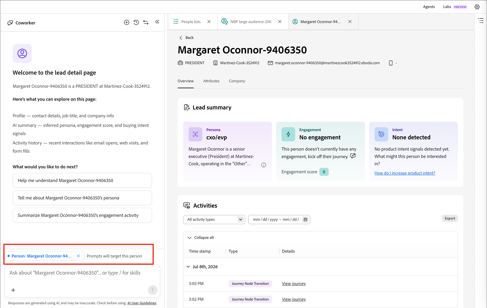

# Detalles de la persona

En [!DNL Adobe Marketo Optimizer], cuando hace clic en el nombre de una persona en la ficha _[!UICONTROL Miembros]_ de una [lista de personas](./people-lists.md), la página de detalles de la persona se abre con una vista consolidada de esa persona. Esta página proporciona:

* Un perfil generado por IA, participación y resumen de intención
* Un historial completo de actividades
* Atributos de perfil y compañía
* Interfaz de chat de compañeros de trabajo diseñada para responder preguntas sobre la persona

## Abrir detalles de la persona {#open-person-details}

1. En el panel de navegación izquierdo, expanda **[!UICONTROL Administración de mercadotecnia]**.

1. A la derecha de la lista de recursos de **[!UICONTROL Marketing]**, seleccione **[!UICONTROL Listas de personas]**.

1. Abra una lista dinámica o estática.

1. Haga clic en **[!UICONTROL Nombre]** de una persona en la lista.

   {width="600" zoomable="yes"}

La página de detalles de la persona se abre con tres fichas: **[!UICONTROL Información general]**, **[!UICONTROL Atributos]** y **[!UICONTROL Compañía]**.

## Encabezado de página {#page-header}

El encabezado muestra el nombre de la persona como título de la página, junto con una tira de contacto de vistazo rápido:

* Cargo
* Compañía
* Dirección de correo electrónico
* Número de teléfono

Haga clic en **[!UICONTROL Atrás]** para regresar a la lista de origen.

## Pestaña Información general {#overview-tab}

La pestaña **[!UICONTROL Información general]** contiene las tarjetas de resumen de los posibles clientes y la cronología de las actividades.

{width="700" zoomable="yes"}

### Resumen de posibles clientes {#lead-summary}

Tres tarjetas proporcionan una evaluación generada por IA de la persona:

| Tarjeta | Contenido |
|---|---|
| **[!UICONTROL Persona]** | La persona [derivada](./personas.md) de la persona, además de una breve narrativa que describe su rol, compañía e industria. Haga clic en el icono de información para obtener más detalles. |
| **[!UICONTROL Participación]** | La [puntuación de participación de la persona](./engagement-scores.md), la tendencia (por ejemplo, _Aumento_) y el nivel (_Bajo_, _Medium_, _Alto_). |
| **[!UICONTROL Intención]** | Se detectó una intención de compra, o _no se detectó ninguna_, con instrucciones contextuales y un vínculo para ayudarle a aumentar la intención del producto. |

### Actividades {#activities}

Debajo del resumen del posible cliente, el panel **[!UICONTROL Actividades]** enumera el historial de interacción completo de la persona, agrupado por fecha. Cada grupo de fecha es expansible y contraíble, y cada fila muestra una marca de tiempo, una etiqueta de tipo de actividad (por ejemplo, _[!UICONTROL Cambiar valor de datos]_, _[!UICONTROL Agregar a lista]_, _[!UICONTROL Agregar persona al Recorrido]_ o _[!UICONTROL Transición de nodo de Recorrido]_) y una descripción en lenguaje sencillo de lo que ha sucedido. Si corresponde, la descripción incluye un vínculo, como **[!UICONTROL Ver lista]** o **[!UICONTROL Ver recorrido]**, para saltar al objeto relacionado.

Utilice los controles del panel para trabajar con la cronología:

* **Tipo de actividad**: filtre la cronología a un tipo de actividad específico, como envíos de correo electrónico, interacciones con seminarios web o cambios en listas y recorridos.
* **Intervalo de fechas**: restrinja la escala de tiempo a un intervalo de fechas específico mediante el control de calendario.
* **[!UICONTROL Exportar]**: exporte los datos de actividad visibles.
* **[!UICONTROL Contraer todo] / [!UICONTROL Expandir todo]**: alterne cada agrupación de fecha abierta o cerrada a la vez.

## Pestaña Atributos {#attributes-tab}

{width="700" zoomable="yes"}

La ficha **[!UICONTROL Atributos]** muestra los campos de perfil almacenados de la persona como una lista de etiqueta/valor:

* Nombre
* Segundo nombre
* Apellido
* Correo electrónico
* Título
* Teléfono
* Dirección
* Ciudad
* Estado
* País
* Compañía
* Creado
* Última actualización

## Pestaña Compañía {#company-tab}

{width="700" zoomable="yes"}

La ficha **[!UICONTROL Compañía]** muestra datos firmográficos asociados con la compañía de la persona:

* Compañía
* Industria
* Ingresos anuales
* Calle de facturación
* Ciudad de facturación
* Estado de facturación
* Código postal de facturación
* País de facturación

Los campos sin datos disponibles se muestran como un guion.

## Preguntar a un compañero sobre una persona {#ask-coworker}

Abra el icono del panel **[!UICONTROL Compañero]** cerca de la parte superior de la página para obtener ayuda con el registro de persona actual. El panel se abre con un ámbito para esa persona; un chip debajo del subproceso del mensaje (por ejemplo, _persona: [Nombre de persona]_) confirma qué registro se dirige a las indicaciones.

{width="700" zoomable="yes"}

### Empezar desde una petición de datos sugerida {#suggested-prompts}

Cuando abre el panel desde la página de detalles de una persona, el compañero le da la bienvenida con un mensaje de bienvenida contextual y le sugiere las siguientes indicaciones predeterminadas:

* _Ayúdame a entender [Nombre de persona]_
* _Háblame del personaje de [Nombre de persona]_
* _Resumir la actividad de participación de [Nombre de persona]_

Haga clic en un mensaje sugerido o escriba su propia pregunta en el cuadro de entrada en la parte inferior del panel.

### Revisar la respuesta {#review-response}

Al seleccionar una solicitud, se ejecuta una [aptitud](../agents/skills.md) de varios pasos, que se muestra como pasos de estado secuenciales (por ejemplo, _Buscar a la persona por identificador_ y _Obtener la historia de la persona_) mientras el Compañero de trabajo redacta la respuesta. La respuesta es un resumen estructurado que puede incluir detalles de perfil, historial de participación y rendimiento de correo electrónico de la persona.

Utilice el control de miniaturas hacia arriba y miniaturas hacia abajo para evaluar la respuesta. Al igual que con todos los resultados de Coworker, revise la respuesta antes de utilizarla. Para obtener más información, consulte las [Directrices de usuario de IA generativa de Adobe](https://www.adobe.com/legal/licenses-terms/adobe-dx-gen-ai-user-guidelines.html){target="_blank"}.
