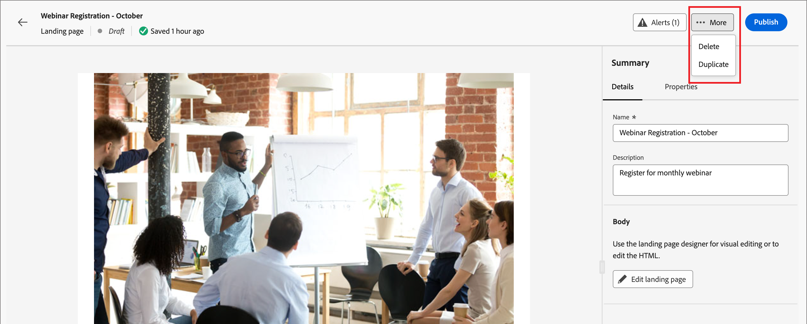
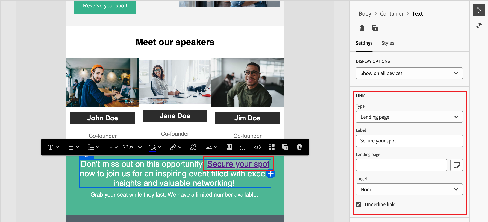

# Páginas de aterrizaje

Una página de aterrizaje es una página web independiente en la que puede dirigir a contactos y clientes después de hacer clic en un elemento vinculado en un correo electrónico, un mensaje SMS o cualquier ubicación digital. Puede incorporar estas páginas en los recorridos para que los clientes potenciales y los clientes vean los mensajes en la web y progresen en los recorridos.

Casos de uso comunes de las páginas de aterrizaje:

* Proporcione comunicaciones de marketing de inclusión o exclusión para un servicio específico. Utilice un vínculo en un correo electrónico u otra comunicación para enviar una lista de destino.
* Recopile el consentimiento antes de enviar comunicaciones y envíe un correo electrónico de confirmación tras la inclusión o la exclusión.
* Capture o actualice datos de perfil (perfil progresivo, preferencias, registros y escenarios similares) mediante formularios en páginas de aterrizaje.
* Dirija a las personas a información específica de la campaña diseñada para su orquestación de recorrido.
* Redirigir a las personas a un formulario web dedicado sin crear una página externa fuera de [!DNL Marketo Optimizer].

## Flujo de trabajo de página de aterrizaje {#workflow}

Para dirigir a los miembros de una audiencia de recorrido a una página web definida cuando hagan clic en un vínculo específico, cree una página de aterrizaje en [!DNL Marketo Optimizer]:

1. [Crear la página](./landing-pages-create-publish.md#create-landing-page): seleccione un ajuste preestablecido, configure la página principal y agregue las subpáginas necesarias.
1. [Diseño del contenido de la página de aterrizaje](./landing-page-design.md): cree el contenido de la página mediante componentes de diseño visuales de arrastrar y soltar.
1. [Probar la página de aterrizaje](./landing-pages-create-publish.md#test-landing-page): previsualice la página y pruebe el comportamiento del formulario.
1. [Publicar la página de aterrizaje](./landing-pages-create-publish.md#publish-landing-page): publique para que la página esté activa y disponible para la vinculación.
1. [Vínculo a la página desde el recorrido](#link-to-landing-page): agregue la dirección URL de la página de aterrizaje a un correo electrónico, un SMS o una acción de recorrido para que los destinatarios puedan llegar a ella.

Por ejemplo, puede crear y diseñar páginas de aterrizaje para dirigir a los usuarios a la información en línea. La página puede incluir un formulario en el que pueden optar por su inclusión o exclusión en la recepción de comunicaciones. O podría ser una oportunidad para suscribirse a una comunicación recurrente, como un boletín informativo.

## Acceso y administración de páginas de aterrizaje {#access-manage-landing-pages}

Para acceder a las páginas de aterrizaje de [!DNL Marketo Optimizer], ve a la navegación izquierda y expande **[!UICONTROL Administración de contenido]**. A continuación, seleccione **[!UICONTROL Páginas de aterrizaje]**. Esta acción muestra una lista de todas las páginas de aterrizaje creadas en la instancia.

{width="800" zoomable="yes"}

La lista se ordena según la columna _[!UICONTROL Modificado]_, con los elementos actualizados más recientemente en la parte superior. Haga clic en el título de la columna para cambiar entre ascendente y descendente.

### Filtrado de la lista de páginas de aterrizaje {#filter-list}

Para buscar una página de aterrizaje por nombre, introduzca una cadena de texto en la barra de búsqueda para buscar una coincidencia. Haga clic en el icono _Filtro_ (  ) para mostrar las opciones de filtro disponibles y cambiar la configuración para filtrar los elementos mostrados según los criterios especificados.

{width="800" zoomable="yes"}

<!-- 
This is going away? ### Customize the column display

Customize the columns that you want to display in the table by clicking the _Customize table_ icon (  ) at the top right. 

In the dialog, select the columns to display and click **[!UICONTROL Apply]**.

{width="300"} 
-->

### Estado de la página de aterrizaje y ciclo vital {#landing-page-status}

El estado de la página de aterrizaje determina su disponibilidad para la vinculación en el contenido del correo electrónico y SMS, y los cambios que puede realizar en él.

| Estado | Descripción |
| -------------------- | ----------- |
| Borrador | Cuando crea una página de aterrizaje, está en estado de borrador. Permanece en este estado a medida que define o edita el contenido visual y hasta que lo publica como una página alojada. Acciones disponibles: <ul><li>Editar nombre o descripción</li><li>Editar URL del vínculo</li><li>Editar en el espacio de diseño visual</li><li>Publicación</li><li>Duplicado</li><li>Eliminar</li></ul> |
| Publicadas | Al publicar una página de aterrizaje, esta se aloja en la instancia [!DNL Marketo Optimizer] y queda disponible para la vinculación en el contenido de un mensaje de correo electrónico o SMS. Acciones disponibles: <ul><li>Editar nombre o descripción</li><li>Editar URL del vínculo</li><li>Añadir vínculo en el contenido del correo electrónico o del mensaje SMS</li><li>Crear versión de borrador</li><li>Duplicado</li><li>Eliminar</li></ul> |
| Publicado con borrador | Cuando crea un borrador a partir de una página de aterrizaje publicada, la versión publicada se mantiene y el contenido del borrador se puede modificar en el espacio de diseño visual. Si publica la versión de borrador, reemplazará la versión publicada actual y el contenido se actualizará en la página alojada. Acciones disponibles: <ul><li>Editar nombre o descripción</li><li>Editar URL del vínculo</li><li>Añadir vínculo en el contenido del correo electrónico o del mensaje SMS</li><li>Editar versión de borrador en el espacio de diseño visual</li><li>Publicar versión de borrador</li><li>Duplicado</li><li>Eliminar (elimina ambas versiones)</li><li>Descartar borrador (vuelve al estado publicado)</li></ul> |

{zoomable="yes"}

## Edición de una página de aterrizaje {#edit-landing-page}

Las ediciones realizadas en una página de aterrizaje dependen de su estado actual:

* Cuando una página de aterrizaje se encuentra en estado **_Borrador_**, puede editar cualquiera de sus detalles, la dirección URL y el contenido visual.
* Cuando una página de aterrizaje se encuentra en estado **_Publicado_**, puede editar la descripción, pero no el nombre. Para cambiar el contenido visual, debe crear una versión de borrador de la página.
* Cuando una página de aterrizaje se encuentra en **_Publicado con el estado Borrador_**, la edición de los detalles se limita a la descripción. También puede editar el contenido visual de la versión de borrador.

>[!BEGINTABS]

>[!TAB Borrador]

1. En la página de listado _[!UICONTROL Páginas de aterrizaje]_, haga clic en el nombre de la página de aterrizaje para abrirla.

   Se muestra una previsualización del contenido visual, con los detalles de la página de aterrizaje a la derecha.

1. Modifique cualquiera de los detalles, como el nombre y la descripción.

   {width="700" zoomable="yes"}

1. Para realizar cambios en el contenido en el espacio de diseño visual, haga clic en **[!UICONTROL Editar página de aterrizaje]**.

   Utilice las herramientas de diseño visual según sea necesario:

   * [Añadir estructura y contenido](./landing-page-design.md#structure-content-landing-page)
   * [Añadir recursos](./landing-page-design.md#add-assets)
   * [Desplazamiento por las capas, la configuración y los estilos](./landing-page-design.md#navigate-layers-settings-styles)
   * [Personalización del contenido](./landing-page-design.md#personalize-content)
   * [Editar seguimiento de URL vinculadas](./landing-page-design.md#linked-url-tracking)

1. Haga clic en **[!UICONTROL Guardar]** o **[!UICONTROL Guardar y cerrar]** para volver a los detalles de la página de aterrizaje.

1. Cuando la página cumpla sus criterios y desee que esté disponible para su visualización, haga clic en **[!UICONTROL Publicar]**.

>[!TAB Publicado]

1. En la página de listado _[!UICONTROL Páginas de aterrizaje]_, haga clic en el nombre de la página para abrirla.

   Se muestra una previsualización del contenido visual, con los detalles de la página de aterrizaje a la derecha.

1. Modifique la descripción, si es necesario.

   No se pueden cambiar todos los demás detalles de una página de aterrizaje publicada.

1. Si desea actualizar el contenido, haga clic en **[!UICONTROL Editar página de aterrizaje]** a la derecha.

   Haga clic en **[!UICONTROL Crear versión de borrador]** en el cuadro de diálogo para abrir la versión de borrador en el espacio de diseño visual.

   Utilice las herramientas de diseño visual según sea necesario:

   * [Añadir estructura y contenido](./landing-page-design.md#structure-content-landing-page)
   * [Añadir recursos](./landing-page-design.md#add-assets)
   * [Desplazamiento por las capas, la configuración y los estilos](./landing-page-design.md#navigate-layers-settings-styles)
   * [Personalización del contenido](./landing-page-design.md#personalize-content)
   * [Editar seguimiento de URL vinculadas](./landing-page-design.md#linked-url-tracking)

1. Haga clic en **[!UICONTROL Guardar]** o **[!UICONTROL Guardar y cerrar]** para volver a los detalles de la página de aterrizaje.

1. Si el borrador de la página de aterrizaje cumple los criterios y desea que los cambios estén disponibles en la página publicada, haga clic en **[!UICONTROL Publicar]**.

   Cuando publica la versión de borrador, reemplaza la versión publicada actual y el contenido se actualiza para la dirección URL de la página.

>[!TAB Publicado con borrador]

Al abrir la página de aterrizaje, se muestra la versión en borrador. Las pestañas de la parte superior del espacio de vista previa permiten alternar la visualización entre las versiones publicadas y las de borrador. Las acciones de borrador y los detalles se muestran a la derecha.

{width="700" zoomable="yes"}

_Para actualizar el contenido :_

1. Haga clic en **[!UICONTROL Editar página de aterrizaje]** en la parte superior derecha. Utilice las herramientas de diseño visual según sea necesario:

   * [Añadir estructura y contenido](./landing-page-design.md#structure-content-landing-page)
   * [Añadir recursos](./landing-page-design.md#add-assets)
   * [Desplazamiento por las capas, la configuración y los estilos](./landing-page-design.md#navigate-layers-settings-styles)
   * [Personalización del contenido](./landing-page-design.md#personalize-content)
   * [Editar seguimiento de URL vinculadas](./landing-page-design.md#linked-url-tracking)

1. Haga clic en **[!UICONTROL Guardar]** o **[!UICONTROL Guardar y cerrar]** para volver a los detalles de la página de aterrizaje.

1. Cuando la página de borrador cumpla sus criterios y desee que los cambios estén disponibles, haga clic en **[!UICONTROL Publicar]**.

   Cuando publica la versión de borrador, reemplaza la versión publicada actual y el contenido se actualiza en la página alojada.

>[!ENDTABS]

## Duplicación de una página de aterrizaje {#duplicate-landing-page}

Puede duplicar una página de aterrizaje mediante cualquiera de los siguientes métodos:

* En la página de listado de _[!UICONTROL Página de aterrizaje]_, haga clic en el icono _Más_ (**...**) junto al nombre de la página de aterrizaje y elija **[!UICONTROL Duplicate]**.
* En la parte superior derecha de la página de aterrizaje, haga clic en **[!UICONTROL ... Más]** y elige **[!UICONTROL Duplicar]**.

{width="600" zoomable="yes"}

En el cuadro de diálogo, introduzca un nombre útil (único) y una descripción (opcional). Haga clic en **[!UICONTROL Duplicar]** para completar la acción.

{width="350"}

La página duplicada (nueva) aparece en el listado de _páginas de aterrizaje_.

## Eliminación de una página de aterrizaje {#delete-landing-page}

Puede eliminar una página de aterrizaje mediante cualquiera de los siguientes métodos:

* En la página de listado de _[!UICONTROL Página de aterrizaje]_, haga clic en el icono _Más_ (**...**) junto al nombre de la página de aterrizaje y elija **[!UICONTROL Eliminar]**.
* En la parte superior derecha de la página de aterrizaje, haga clic en **[!UICONTROL ... Más]** y elige **[!UICONTROL Eliminar]**.

Esta acción abre un cuadro de diálogo de confirmación. Puede anular el proceso haciendo clic en **[!UICONTROL Cancelar]** o en **[!UICONTROL Eliminar]** para confirmar la eliminación.

{width="400"}

## Vínculo a una página de aterrizaje {#link-to-landing-page}

Como experto en marketing o creativo que produce contenido de correo electrónico, fragmentos y páginas, puede incrustar vínculos a las páginas de aterrizaje publicadas (activas) que se crean en su instancia de [!DNL Marketo Optimizer].

1. Cuando trabaje en el espacio de diseño visual para un fragmento, correo electrónico, página de aterrizaje o plantilla, seleccione un extracto de texto, un componente de botón o un componente de imagen para el vínculo.

   Las opciones de **[!UICONTROL Link]** se muestran en el panel derecho.

1. Para la opción **[!UICONTROL Type]**, elija **[!UICONTROL Página de aterrizaje]**.

   {width="700" zoomable="yes"}

1. Para la opción **[!UICONTROL Página de aterrizaje]**, haga clic en el icono _Seleccionar página_ (  ).

1. En el cuadro de diálogo Seleccionar página de aterrizaje, establezca **[!UICONTROL Origen de la página de aterrizaje]** como **[!UICONTROL Journey Optimizer B2B edition]**, seleccione la casilla de verificación de la página de aterrizaje en la lista de páginas publicadas y haga clic en **[!UICONTROL Seleccionar]**.

   {width="600" zoomable="yes"}

1. Para la opción **[!UICONTROL Target]**, elija el comportamiento de destino del vínculo:

   * **[!UICONTROL Ninguno]**: abre el vínculo con el comportamiento predeterminado del explorador.
   * **[!UICONTROL En blanco]**: abre el vínculo en una nueva ventana o ficha.
   * **[!UICONTROL Self]**: abre el vínculo en el mismo fotograma.
   * **[!UICONTROL Principal]**: abre el vínculo en el marco principal.
   * **[!UICONTROL Superior]**: abre el vínculo en todo el cuerpo de la ventana.

1. (Solo vínculo de texto) Si desea subrayar el texto vinculado, active la casilla de verificación **[!UICONTROL Subrayar vínculo]**.

   Puede establecer un estilo adicional para el texto del vínculo, incluido el color del vínculo, seleccionando la ficha **[!UICONTROL Estilos]** en el panel derecho.
