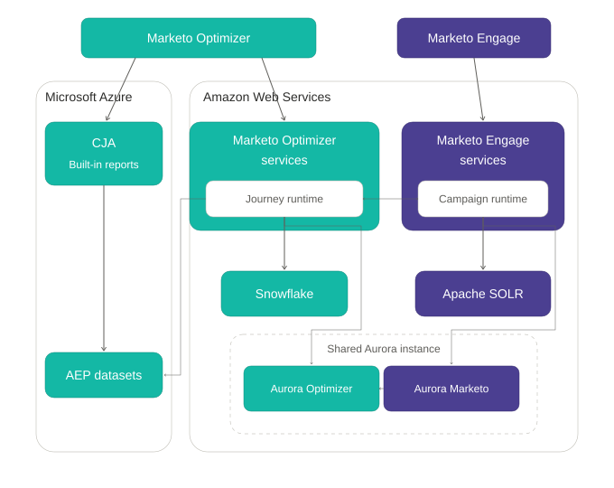

# Arquitectura de datos

[!DNL Adobe Marketo Optimizer] se integra con [!DNL Adobe Marketo Engage] para ofrecer una vista completa de los posibles clientes B2B. Una sincronización bidireccional y de confianza mantiene a ambos productos alineados, de modo que comparten una sola vista de personas, empresas, objetos personalizados y actividades. [!DNL Marketo Engage] sigue siendo el origen autorizado de los datos de la persona. Cada instancia [!DNL Marketo Optimizer] está emparejada con una instancia [!DNL Marketo Engage].

## Base de datos {#data-foundation}

[!DNL Marketo Optimizer] y [!DNL Marketo Engage] comparten una base de datos común que los mantiene sincronizados mientras se alimentan los análisis descendentes.

En un nivel superior:

* **[!DNL Marketo Engage]** es el origen definitivo de los datos de clientes potenciales y objetos personalizados, lo que garantiza la integridad de los datos en el punto de captura.
* Una **capa de Data Broker** coordina cómo se mueven los datos entre los dos productos. Agrega datos compartidos y replicados en una base de datos operativa que está lista para usar. Todo el intercambio se ejecuta dentro de un solo clúster MySQL de Aurora.
* **[!DNL Marketo Optimizer]** es el origen autorizado para las actividades de recorrido que ejecuta.

## Sincronización de entidades {#entity-sync}

Cada tipo de entidad se sincroniza en la dirección y a la velocidad que mejor proteja la integridad de los datos.

| [!DNL Marketo Engage] entidad | Dirección de sincronización | Latencia |
| --- | --- | --- |
| Posible cliente | Bidireccional | Menos de 1 segundo |
| Compañía | Bidireccional | Menos de 1 segundo |
| Objeto personalizado | Unidireccional | Menos de 5 segundos |
| Actividad | Unidireccional | Menos de 5 segundos |
| abono al programa | No sincronizado | No aplicable |
| Recursos | No sincronizado | No aplicable |

La sincronización funciona de dos maneras:

* **Posibles clientes, empresas y objetos estándar:** [!DNL Marketo Engage] es propietario de la tabla de personas y la comparte a través de vistas de bases de datos de lectura y escritura. Las actualizaciones de un producto aparecen en el otro de inmediato y no se crean copias duplicadas.
* **Objetos personalizados:** Los datos se replican desde [!DNL Marketo Engage] en cuestión de segundos. Las actualizaciones de esquema de [!DNL Marketo Engage] están disponibles inmediatamente para los recorridos activos.

[!DNL Marketo Engage] y [!DNL Marketo Optimizer] no sincronizan la pertenencia a programas o recursos. Esta exclusión preserva la velocidad y la integridad del sistema.

>[!NOTE]
>
>En última instancia, los datos sincronizados con [!DNL Marketo Optimizer] y con el almacén de datos son coherentes. El tiempo depende de la captura de datos de cambio subyacente, el lote o el mecanismo de flujo.

Este diseño casi en tiempo real le proporciona datos actuales en recorridos e informes. Puede realizar un seguimiento rápido de los posibles clientes de alta prioridad. También puede utilizar datos de contexto B2B, como el uso del producto y la intención de utilizarlo, en las decisiones de recorrido a medida que cambia.

## Flujo de datos de actividad {#activity-flow}

Las actividades siguen una ruta independiente de otras entidades. Cada actividad se desplaza por cinco fases:

1. **Captura principal:** [!DNL Marketo Engage] escribe la actividad en su base de datos compartida y la indexa en Apache SOLR para realizar búsquedas rápidas en [!DNL Marketo Engage].
1. **Reconocimiento entre productos:** [!DNL Marketo Engage] publica la actividad en la canalización de actividades, por lo que [!DNL Marketo Optimizer] la recibe inmediatamente.
1. **Transformación analítica:** El tiempo de ejecución de recorrido procesa la actividad y la escribe en Snowflake, lo que convierte los datos operativos en datos listos para análisis. Todas las etapas ejecutadas hasta el momento en Amazon Web Service (AWS).
1. **Destino descendente:** [!DNL Marketo Optimizer] replica la actividad en [!DNL Adobe Experience Platform] conjuntos de datos.
1. **Informes:** La fuente de conjuntos de datos incrustó [!DNL Adobe Customer Journey Analytics] informes. [!DNL Customer Journey Analytics] se puede alojar en Microsoft Azure o AWS. También puede consultar los conjuntos de datos con [!DNL Query Service]. Ver [conjuntos de datos de Experience Platform](./reports/aep-datasets.md).

Las audiencias de recorridos y eventos pueden usar actividades [!DNL Marketo Optimizer] y un subconjunto de actividades [!DNL Marketo Engage]. Los dos conjuntos se utilizan del mismo modo. [!DNL Marketo Optimizer] actividades no se han devuelto a [!DNL Marketo Engage].

Utilice actividades como rellenos de formulario, visitas web y participación por correo electrónico para filtrar y almacenar en déclencheur los recorridos de persona de la rama:

* [Déclencheur de eventos para el nodo Escuchar para un evento](./marketing/listen-for-event-nodes.md#event-triggers)
* [Filtros de eventos para el nodo Escuchar para un evento](./marketing/listen-for-event-nodes.md#event-filters)
* [Filtros de persona coincidentes para nodos de rutas divididas](./marketing/split-merge-paths-nodes.md#matched-person-filters)
* [Audiencias basadas en eventos](./audiences/event-based-audiences.md)

## Aislamiento de datos y zonas protegidas {#data-isolation}

[!DNL Marketo Engage], [!DNL Marketo Optimizer] y [!DNL Experience Platform] comparten datos de clientes como parte de esta arquitectura. Adobe aísla lógicamente los datos de otros inquilinos mediante [!DNL Experience Platform] zonas protegidas. Los datos se mueven por canales seguros y cifrados. Adobe lo almacena en Adobe Managed Services con cifrado y controles de acceso estándar del sector.

Cada instancia de [!DNL Marketo Optimizer] tiene una tarjeta de producto dedicada en [!DNL Adobe Admin Console] y una zona protegida dedicada. Adobe aprovisiona ambos automáticamente, por lo que no crea una zona protegida. El nombre de la zona protegida utiliza el patrón `mktoaep<prefix>`, donde el prefijo es su prefijo [!DNL Marketo Engage]. Si usa [!DNL Marketo Optimizer] con más de una instancia de [!DNL Marketo Engage], cada instancia tendrá su propia tarjeta de producto y zona protegida.

[!DNL Marketo Optimizer] solo está disponible en esta zona protegida, aunque su organización tenga otras zonas protegidas.

El aprovisionamiento no asigna acceso a zonas protegidas. Los roles generalmente tienen acceso a la zona protegida predeterminada `prod`, pero [!DNL Marketo Optimizer] no la usa. Asigne explícitamente la zona protegida dedicada a cada rol de [!DNL Experience Platform], o los usuarios no podrán trabajar en [!DNL Marketo Optimizer]. Utilice grupos de usuarios para agregar y quitar usuarios sin repetir la configuración de funciones. Para ver el procedimiento completo, consulte [Acceso y permisos de usuario](./start/user-management.md).

[!DNL Marketo Optimizer] también usa los servicios de [!DNL Experience Platform] en segundo plano. Estos incluyen el registro de esquemas, destinos para la exportación de medios pagados, control de acceso y [!DNL Customer Journey Analytics]. No se configuran esquemas ni áreas de nombres. [!DNL Marketo Optimizer] no requiere [!DNL Real-Time Customer Data Platform], perfil del cliente en tiempo real o segmentación.

>[!WARNING]
>
>No elimine la zona protegida [!DNL Marketo Optimizer] dedicada. La eliminación es permanente y no se puede deshacer. Reaprovisionar [!DNL Marketo Optimizer] para recuperarlo.
