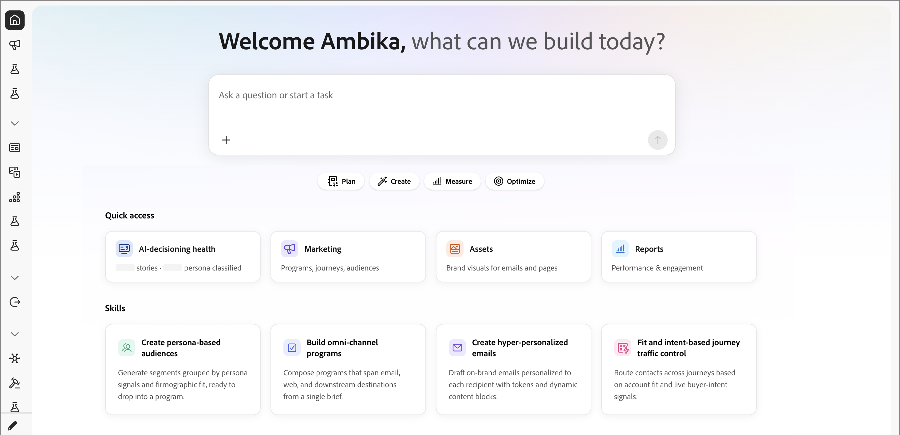

# Página de inicio

La página _Inicio_ es su plataforma de inicio en Adobe Marketo Optimizer. Seleccione el icono _Inicio_ en la parte superior de la navegación izquierda para abrirlo. La página le saluda con **Bienvenido [nombre], ¿qué podemos construir hoy?** y está diseñado para llevarle de la idea a la acción en un solo clic.

{width="800" zoomable="yes"}

## Cuadro de entrada

Una entrada de _Formular una pregunta o iniciar una tarea_ grande se encuentra en el centro de la página principal. Escriba cualquier cosa aquí para comenzar a trabajar con el panel conversacional de IA o use el icono _Adjuntar_ (**+**) para agregar un archivo (como un resumen de campaña o un CSV) antes de enviar. Este es el mismo compañero disponible durante toda la gestión de marketing, pero comenzar aquí abre una nueva conversación.

## Botones de intención

Debajo del cuadro de entrada, cuatro botones de inicio rápido enmarcan lo que desea lograr:

| Botón | Uso |
|--------|------------|
| **Plan** | Estrategia de forma: Planifique campañas, programas y audiencias antes de crear. |
| **Create** | Crear cosas: programas, recorridos, correos electrónicos, listas de personas. |
| **Medida** | Observar el rendimiento: informes, participación, resultados de tiempo de envío. |
| **Optimizar** | Mejore lo que está activo: control de tráfico, puntuación, personalización. |

## Acceso rápido

Hay cuatro tarjetas de acceso directo que puede utilizar para saltar rápidamente directamente a un área de trabajo:

| Tarjeta | A qué puede acceder |
|------|-----------------|
| [estado de toma de decisiones de IA](../agents/ai-decisioning-health.md) | Volumen de la historia y cobertura de clasificación personal, con un informe de estado completo en el espacio de trabajo. |
| **Marketing** | Programas, recorridos, audiencias (Gestión de marketing). |
| **Recursos** | Correos electrónicos, páginas, plantillas y tokens. |
| **Informes** | Métricas de rendimiento y participación. |

## Habilidades

Una fila de tarjetas _Skill_ muestra flujos de trabajo de IA de alto valor que puede iniciar inmediatamente:

- **Crear audiencias basadas en personas**: genere segmentos agrupados por señales de personas y ajuste firmográfico, listos para colocarlos en un programa.
- **Generar programas omnicanal**: componga programas que abarquen destinos de correo electrónico, web y de flujo descendente desde una sola descripción.
- **Crear correos electrónicos hiper-personalizados** — Borradores de correos electrónicos en la marca personalizados por destinatario con tokens y bloques de contenido dinámico.
- **Control de tráfico de recorrido por intención y ajuste**: envía contactos entre recorridos según el ajuste de la cuenta y las señales de intención de comprador en directo.

Haga clic en una tarjeta de aptitudes para iniciar una conversación preparada para ese flujo de trabajo. Las aptitudes son los mismos componentes básicos disponibles en el panel de chat: las tarjetas son un punto de entrada reconocible.
