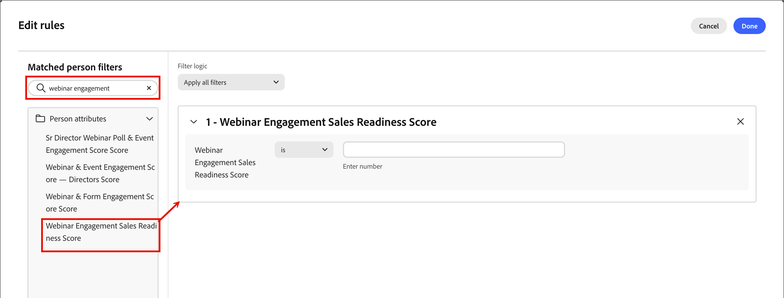

# Puntuación de Studio

Scoring Studio incluye una lista de modelos, un lienzo editable para cada modelo y la [interfaz de chat de Coworker](../agents/chat-interface.md). Utilice el lienzo para revisar o ajustar dimensiones y señales directamente, mientras que Coworker continúa proponiendo cambios en el lenguaje natural a su lado. Para obtener información acerca de cómo crear un modelo a partir de una solicitud, vea [_Crear modelos de puntuación personalizados_](../agents/lead-scoring-model.md).

## Lista de modelos {#model-list}

La lista de modelos es la vista de aterrizaje de Scoring Studio. Muestra todos los modelos de puntuación de la instancia [!DNL Marketo Optimizer] como filas de una tabla o como tarjetas si cambia a la vista de cuadrícula.

{width="800" zoomable="yes"}

| Columna | Descripción |
| --- | --- |
| Nombre | Seleccione el nombre de un modelo para abrirlo en el lienzo. |
| Estado | _[!UICONTROL Activo]_, _[!UICONTROL Borrador]_ o _[!UICONTROL Archivado]_. |
| Dimensiones | Número de dimensiones del modelo. |
| Señales | Número de señales del modelo. |
| Última modificación | La fecha en la que se cambió el modelo por última vez. |
| Última modificación de | La última persona que cambió el modelo. |
| Creado el | La fecha de creación del modelo. |
| Creado por | La persona que creó el modelo. |

Utilice el campo de búsqueda para buscar un modelo por nombre o filtre la lista por estado. Seleccione el **[!UICONTROL menú Más]** de una fila para **[!UICONTROL editar]**, **[!UICONTROL duplicar]**, **[!UICONTROL archivar]** o **[!UICONTROL eliminar]** un modelo.

Un modelo activo es de solo lectura. Para cambiarlo, duplique y edite el duplicado. A continuación, archive el original y publique la copia modificada.

## Lienzo de modelo {#model-canvas}

Al seleccionar el nombre de un modelo, se abre en el lienzo. Cada modelo abierto aparece como su propia pestaña, por lo que puede trabajar en varios modelos. El lienzo está organizado en fichas, incluidas **[!UICONTROL Reglas]** y **[!UICONTROL Posible cliente]**.

En la ficha **[!UICONTROL Reglas]**, cada dimensión del modelo es una columna en el lienzo. Cada encabezado de columna muestra el nombre de dimensión y su total de puntos con respecto a su límite, por ejemplo `20 / 30 pts`, con una barra de progreso que se rellena a medida que sus señales aportan puntos.

{width="700" zoomable="yes"}

Dentro de cada dimensión, cada señal aparece como una tarjeta que muestra su nombre, su valor de punto y su frecuencia coincidente (por ejemplo, `1 time / day`) o `Static` para señales basadas en atributos que no dependen de la actividad.

Cuando Coworker detecta un patrón en varias actividades, puede combinarlo en una sola tarjeta de señal compuesta que resuma cada condición.

## Configuración de una señal {#configure-signal}

Para revisar o cambiar una señal, siga estos pasos.

1. Seleccione **[!UICONTROL Editar borrador]**.

1. Seleccione una tarjeta de señal en el lienzo.

   El panel de propiedades se abre en el lado derecho del lienzo.

   {width="700" zoomable="yes"}

1. Seleccione el icono **[!UICONTROL Editar]** (  ) y, a continuación, actualice las propiedades de la señal:

   * En **[!UICONTROL Señal]**, confirme el tipo de señal (una actividad o un atributo) y la actividad o atributo específico que puntúa.

   * En **[!UICONTROL Activar esto el]**, establezca las condiciones que deben coincidir.

     Agregue los elementos que desee usar, como páginas específicas, y si **[!UICONTROL Cualquiera de]** o **[!UICONTROL Todos de]** las condiciones deben ser verdaderas.

   * En **[!UICONTROL Puntos]**, defina cuántos puntos aporta la señal.

     De manera opcional, establezca un **[!UICONTROL Límite]** para limitar la cantidad de puntos que puede aportar por persona. El compañero muestra un rango de puntos sugerido basado en las otras señales del modelo.

   * Para señales basadas en actividad, establezca la **[!UICONTROL Frecuencia]** necesaria antes de que la señal otorgue puntos.

     De manera opcional, establezca un porcentaje de **[!UICONTROL Decaimiento]** que reduzca los puntos de la señal después de un número determinado de días.

   * Habilite la opción **[!UICONTROL Evite anotar las mismas acciones dos veces]** para otorgar puntos solo una vez por persona, sin importar cuántas veces suceda la actividad.

     Desactive la opción para asignar puntos cada vez que se produzca la actividad. Esta opción está activada de forma predeterminada.

1. Seleccione **[!UICONTROL Guardar]** para aplicar los cambios y volver al lienzo.

## Segmento de posible cliente {#lead-segment}

Cada modelo de puntuación puntúa un segmento de posible cliente, una referencia a una lista de personas existente en lugar de a las reglas definidas dentro de Scoring Studio. Cuando el Compañero de trabajo crea un modelo, selecciona una lista coincidente o crea una nueva.

Para cambiar la lista, selecciona la ficha **[!UICONTROL Posible cliente]** y, a continuación, selecciona **[!UICONTROL Cambiar]** junto al segmento de posibles clientes.

{width="700" zoomable="yes"}

Un segmento de posibles clientes utiliza uno de los dos tipos de lista:

* **Lista estática**: un conjunto fijo de personas capturadas cuando se creó la lista.
* **Lista inteligente**: una lista que vuelve a evaluar sus reglas de pertenencia cada vez que se ejecuta el modelo, por lo que el segmento siempre refleja los criterios de la lista.

La vista previa del modelo muestra el nombre del segmento, su recuento de miembros y un vínculo **[!UICONTROL Ver lista de personas]** que abre la lista directamente. Para obtener más información acerca de la administración de listas, vea [_Listas de personas_](../audiences/people-lists.md).

Si la lista a la que se hace referencia está vacía o se elimina posteriormente, el modelo deja de puntuar en lugar de volver a caer en toda la audiencia. No se puntúan posibles clientes hasta que asigne una lista válida que no esté vacía.

Debajo del segmento de posibles clientes, la tarjeta **[!UICONTROL Nombre del campo de puntuación]** muestra el atributo de posible cliente al que el modelo escribe su puntuación. De forma predeterminada, el nombre de campo coincide con el nombre del modelo. Seleccione **[!UICONTROL Editar]** para cambiarle el nombre.

## Publicación y programación {#publish-schedule}

Cuando el modelo esté listo, haga clic en **[!UICONTROL Publicar]**.

{width="700" zoomable="yes"}

Elija la frecuencia con la que el modelo puntúa su audiencia: diaria, semanal o mensual. También puede elegir una opción manual para ejecutar el modelo.

{width="420" zoomable="no"}

Para ver el proceso de publicación completo mediante la [interfaz de chat de Coworker](../agents/chat-interface.md), incluido cómo [!DNL Marketo Optimizer] aprovisiona un campo de puntuación automáticamente, consulte [_Publicar un modelo de puntuación_](../agents/lead-scoring-model.md#publish-model).

Las puntuaciones más recientes se almacenan en un campo aprovisionado que se sincroniza con la instancia de [!DNL Marketo Engage].

{width="800" zoomable="yes"}

## Uso de puntuaciones en filtros {#filter-score}

Después de [publicar un modelo](#publish-schedule), puede usar su puntuación resultante como filtro al crear audiencias basadas en eventos y _Escuchar un evento_ nodos, como una condición de ruta de acceso dividida o para la pertenencia a listas de personas.

La puntuación aparece en el panel de filtro bajo la categoría **[!UICONTROL Atributos de persona]**, etiquetada con el nombre del modelo o el nombre del campo de puntuación [_personalizado_](#lead-segment) que le asignó. Introduzca ese nombre en el campo de búsqueda del panel de filtro para localizar la puntuación, arrástrela al lienzo y defina los criterios.

### Audiencias y nodos basados en eventos {#scoring-model-event-audience}

Para usar un resultado de modelo de puntuación para filtrar por una [audiencia basada en eventos](../audiences/event-based-audiences.md) o [_Escuchar un evento_ nodo](../marketing/listen-for-event-nodes.md):

1. Haga clic en **[!UICONTROL Agregar criterios de evento]**.

1. En el cuadro de diálogo _[!UICONTROL Editar criterios del evento]_, seleccione la pestaña **[!UICONTROL Filtros]**.

1. Introduzca el nombre del modelo en el campo de búsqueda y arrastre la puntuación al lienzo.

   {width="700" zoomable="yes"}

1. Establezca el operador y el valor para que coincidan con las puntuaciones que desee establecer como objetivo.

1. Haga clic en **[!UICONTROL Guardar]**.

### Condiciones de ruta dividida {#split-path-conditions}

Para usar un resultado de modelo de puntuación para definir las condiciones de ruta para un nodo [_Split paths_](../marketing/split-merge-paths-nodes.md):

1. Haga clic en **[!UICONTROL Editar condición]** para la ruta del nodo.

1. En el cuadro de diálogo _[!UICONTROL Condiciones]_, escriba el nombre del modelo en el campo de búsqueda y, a continuación, arrastre la puntuación coincidente al lienzo.

   {width="700" zoomable="yes"}

1. Establezca el operador y el valor para que coincidan con las puntuaciones que desee establecer como objetivo.

1. Haga clic en **[!UICONTROL Listo]** para guardar la condición de la ruta.

### Abono a lista de personas {#scoring-model-people-lists}

Para administrar la pertenencia a [listas de personas](../audiences/people-lists.md) mediante un resultado de modelo de puntuación:

**Lista estática — Agregar miembros**

1. Abra la lista estática y haga clic en **[!UICONTROL Agregar personas]**.

1. En el cuadro de diálogo _[!UICONTROL Agregar personas]_, escriba el nombre del modelo en el campo de búsqueda y, a continuación, arrastre la puntuación coincidente al lienzo.

   {width="700" zoomable="yes"}

1. Establezca el operador y el valor para que coincidan con las puntuaciones que desee establecer como objetivo.

1. Haga clic en **[!UICONTROL Listo]** para aplicar el filtro y calificar a las personas coincidentes en la lista.

**Lista dinámica — Establecer reglas de pertenencia**

1. Abra la lista dinámica y seleccione la ficha **[!UICONTROL Reglas]**.

1. Haga clic en **[!UICONTROL Editar reglas]**.

1. En el cuadro de diálogo _[!UICONTROL Editar reglas]_, escriba el nombre del modelo en el campo de búsqueda y, a continuación, arrastre el elemento de puntuación al lienzo.

   {width="700" zoomable="yes"}

1. Establezca el operador y el valor para que coincidan con las puntuaciones que desee establecer como objetivo.

1. Haga clic en **[!UICONTROL Listo]** para guardar la regla.

   La pertenencia se actualiza automáticamente a medida que se evalúan los registros de persona según la regla.
