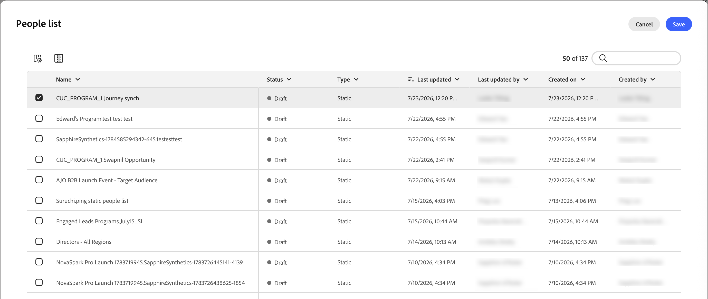
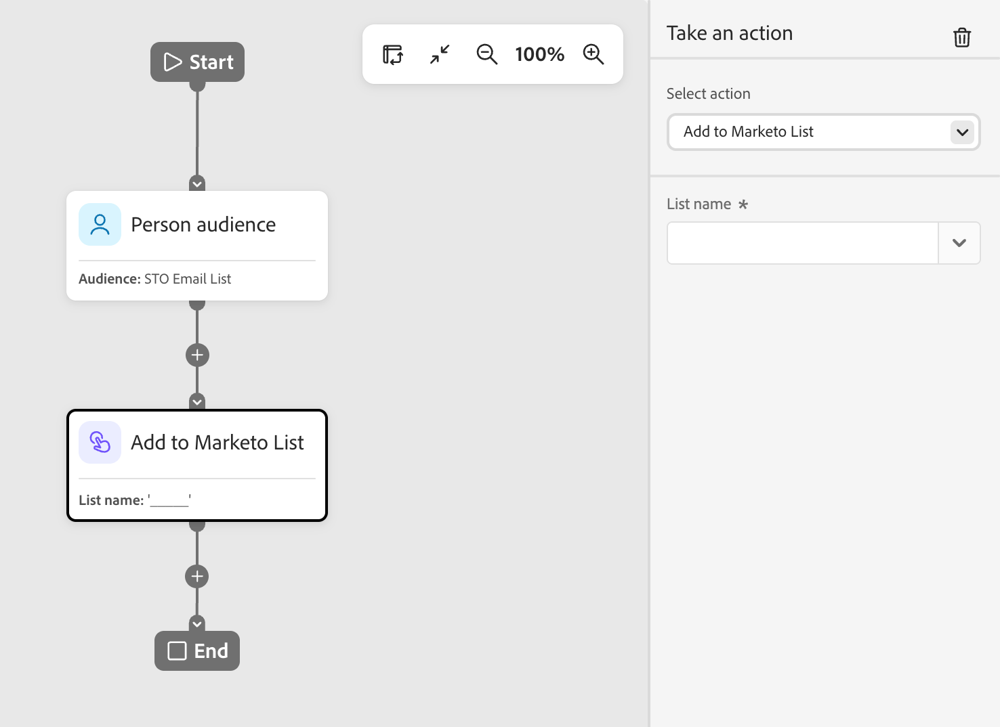
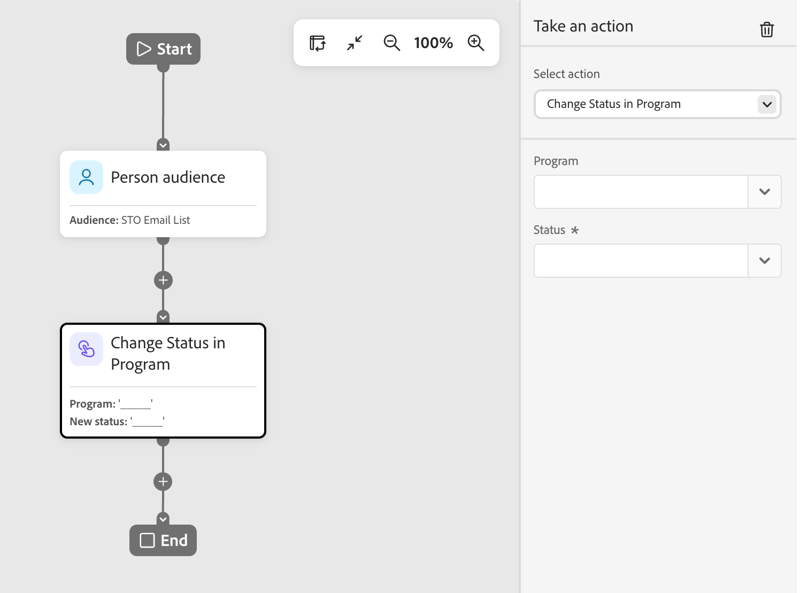
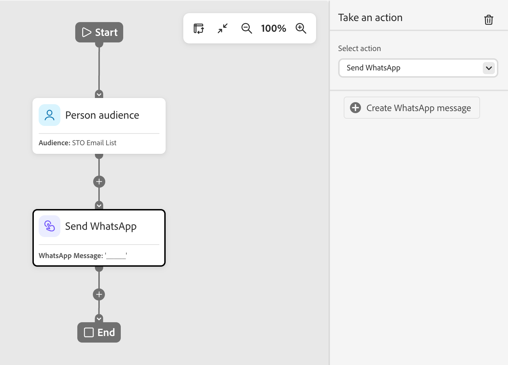

# Realizar un nodo de acción

En el recorrido de una persona, utilice una acción para las personas cuando desee aplicar un cambio a todas las personas de la ruta del nodo.

## Acciones y restricciones {#actions}

| Acción | Restricciones |
| ------ | ----------- |
| **[!UICONTROL Activar en destino]** | <li>Seleccionar o crear una lista estática <li>Si la lista no tiene un destino activado, active la lista a uno o más destinos |
| **[!UICONTROL Agregar persona al recorrido]** | <li>Seleccionar un recorrido programado o activo <li>No se aplican los criterios de audiencia del recorrido de destinatario |
| **[!UICONTROL Agregar a lista]** | <li>Cree una nueva lista estática o seleccione una existente |
| **[!UICONTROL Agregar a la lista de Marketo Engage]** | <li>Seleccione una lista estática en Marketo Engage |
| **[!UICONTROL Cambiar valor de datos]** | <li>Seleccionar atributo de persona <li>Establecer nuevo valor |
| **[!UICONTROL Cambiar estado en el programa]** | <li>Seleccionar programa<li>Seleccionar nuevo estado |
| **[!UICONTROL Cambiar estado de miembro del seminario web]** | <li>Seleccionar programa<li>Seleccionar nuevo estado |
| **[!UICONTROL Quitar de la lista]** | <li>Seleccionar lista estática <li>Omite la persona si actualmente no es miembro |
| **[!UICONTROL Quitar de la lista de Marketo Engage]** | <li>Seleccione una lista estática en Marketo Engage <li>Omite la persona si actualmente no es miembro |
| **[!UICONTROL Quitar persona del recorrido]** | <li>Seleccionar un recorrido activo <li>Omite la persona si actualmente no es miembro del recorrido de destinatario |
| **[!UICONTROL Solicitar campaña de Marketo Engage]** | <li>Seleccione una campaña de Marketo Engage |
| **[!UICONTROL Enviar correo electrónico]** | <li>Crear, editar o utilizar un correo electrónico personalizado con IA <li>Optimización del tiempo de envío (opcional) |
| **[!UICONTROL Enviar WhatsApp]** | <li>Seleccione un mensaje de WhatsApp |

<!-- 
removed? | **[!UICONTROL Change Program Data]** | <li>Select program attribute <li>Set new value | 
-->

## Añadir un nodo de acción {#add-an-action-node}

1. Navegue hasta el lienzo de recorrido.

1. Haga clic en el icono de signo más ( **+** ) en una ruta y elija **[!UICONTROL Realizar una acción]**.

   {width="200"}

1. En las propiedades del nodo, a la derecha, seleccione una acción de la lista y establezca los valores para la acción.

+++Activar en destino

Utilice esta acción para agregar personas a una lista estática y activar esa lista en un destino directamente desde el recorrido. Puede utilizar una lista estática existente o crear una específica para el recorrido.

>[!PREREQUISITES]
>
>Debe tener uno o más [destinos configurados](../audiences/destinations.md) para la zona protegida [!DNL Marketo Optimizer] antes de configurar un nodo de recorrido _Activar en destino_.

{width="450"}

En **[!UICONTROL Agregar a la lista]**, elija una de las siguientes opciones:

* **[!UICONTROL Crear]**: cree una nueva lista estática y agréguele personas. La lista está disponible inmediatamente en **[!UICONTROL Listas de personas]**.

  Seleccione un programa principal de la lista y escriba un **[!UICONTROL Nombre]** (obligatorio) y una **[!UICONTROL Descripción]** (opcional). Haga clic en **[!UICONTROL Crear]** para agregar la nueva lista para el nodo.

  {width="375"}

* **[!UICONTROL Seleccionar]**: seleccione una lista estática existente en la que desee agregar personas que lleguen al nodo.

  Seleccione la casilla de verificación de la lista estática existente y haga clic en **[!UICONTROL Guardar]**.

  {width="700" zoomable="yes"}

Cualquier persona que llegue al nodo se agregará a la lista estática seleccionada, pero la acción no se completará hasta que se active la lista en un destino:

* Si la lista seleccionada ya está activada, sus destinos aparecerán en **[!UICONTROL Destinos]** y la acción estará lista.
* De lo contrario, aparecerá un mensaje _Se requiere al menos un destino_. Haga clic en **[!UICONTROL Activar lista en destino]**, seleccione el destino y haga clic en **[!UICONTROL Guardar]**. Haga clic en **[!UICONTROL Activar]** en el cuadro de diálogo de confirmación.

{width="600" zoomable="yes"}

Cuando finaliza la activación, el destino aparece en **[!UICONTROL Destinos]** y la acción está lista. Puede activar la lista a destinos adicionales si es necesario.

Cualquier persona que llegue al nodo se añade a la lista estática seleccionada, que se activa en el destino elegido, por lo que se añade a esa audiencia de destino y, a su vez, a cualquier campaña que alimente la audiencia.

+++

+++[!UICONTROL Agregar persona al recorrido]

Utilice esta acción para agregar personas a otros recorridos programados o en directo. Las personas añadidas a través de esta acción se añaden inmediatamente a la audiencia del recorrido objetivo; no se aplican los criterios de audiencia del recorrido objetivo.

{width="450"}

+++

+++[!UICONTROL Agregar a lista]

Utilice esta acción para agregar personas a una lista estática en Marketo Optimizer.

{width="450"}

Elija una de las siguientes opciones:

* **[!UICONTROL Crear]**: cree un nuevo recurso de lista estática y agréguele personas. La lista está disponible inmediatamente para que la utilicen otros recursos en Marketo Optimizer.
* **[!UICONTROL Seleccionar]**: seleccione un recurso de lista estática existente en el que desee agregar personas que lleguen al nodo.

+++

+++[!UICONTROL Agregar a la lista de Marketo Engage]

Utilice esta acción para agregar personas a una lista estática en Marketo Engage.

{width="450"}

+++

+++[!UICONTROL Cambiar valor de datos]

Utilice esta acción para actualizar el valor de un atributo en un registro de persona. Seleccione el atributo y defina el nuevo valor.

>[!TIP]
>
>Para borrar el valor de un atributo, establezca el valor en `NULL`.

{width="450"}

+++

+++[!UICONTROL Cambiar estado en el programa]

Utilice esta acción para cambiar el estado de una persona en un programa de Marketo Engage. Seleccione el programa y, a continuación, seleccione el nuevo estado.

{width="450"}

+++

+++[!UICONTROL Cambiar estado de miembro del seminario web]

Utilice esta acción para cambiar el estado de una persona en relación con un seminario web interactivo. Seleccione el seminario web y, a continuación, el nuevo estado.

{width="450"}

+++

+++[!UICONTROL Quitar de la lista]

Utilice esta acción para eliminar personas de una lista estática en Marketo Optimizer. Si una persona no es miembro de la lista, la acción se omitirá para esa persona.

{width="450"}

+++

+++[!UICONTROL Quitar de la lista de Marketo Engage]

Utilice esta acción para eliminar personas de una lista estática en Marketo Engage. Si una persona no es miembro de la lista, la acción se omitirá para esa persona.

{width="450"}

+++

+++[!UICONTROL Quitar persona del recorrido]

Utilice esta acción para eliminar personas de otros recorridos de personas activas. La persona se elimina inmediatamente del recorrido de destino y no se realizan más acciones al respecto. Si una persona no es actualmente miembro del recorrido de destino, la acción se omitirá para esa persona.

{width="450"}

+++

+++[!UICONTROL Solicitar campaña de Marketo Engage]

Utilice esta acción para añadir personas a una campaña de solicitud en una instancia de Marketo Engage conectada. Seleccione la campaña de Marketo Engage que desea solicitar.

{width="450"}

+++

+++[!UICONTROL Enviar correo electrónico]

Utilice esta acción para enviar un correo electrónico a las personas incluidas en la opción. Las personas que han cancelado la suscripción, están en la lista de bloqueados, están suspendidas por correo electrónico o están suspendidas por marketing omiten esta acción.

{width="450"}

Puede crear un correo electrónico, editar uno existente o utilizar un correo electrónico personalizado con IA. Para obtener información sobre cómo crear y editar correos electrónicos, consulte [Canal de correo electrónico](./email-channel.md). Para generar variantes basadas en personas para un correo electrónico existente, consulte [Personalizar el contenido del correo electrónico por persona](../agents/personalize-content.md).

Puede usar [Optimización del tiempo de envío](./email-send-time-optimization.md) para personalizar el tiempo de envío del correo electrónico mediante la predicción de cuándo es más probable que se involucre cada perfil.

+++

+++[!UICONTROL Enviar WhatsApp]

Utiliza esta acción para enviar un mensaje de WhatsApp. Puede crear, personalizar y previsualizar mensajes de WhatsApp en el espacio de diseño visual (consulte [Creación de WhatsApp](../content/whatsapp-authoring.md)).

{width="450"}

+++
