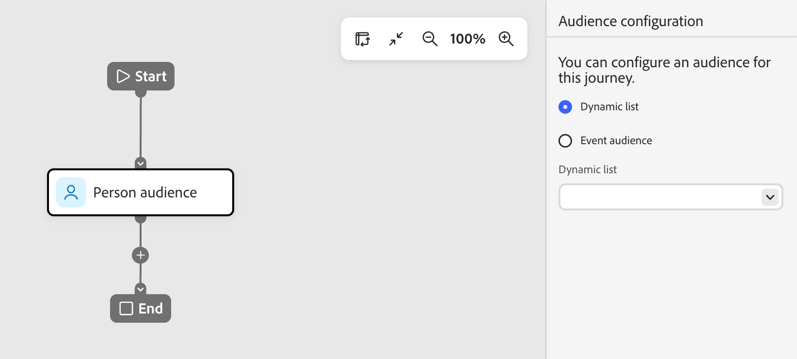

# Nodo de audiencia de persona

El nodo _audiencia de persona_ especifica qué perfiles de persona entran en el recorrido. Cuando [crea un recorrido de persona](./person-journeys.md), el recorrido siempre comienza con un nodo de audiencia de persona que define su entrada. El nodo de audiencia de persona puede tener uno de estos dos tipos de entrada de audiencia: una lista dinámica de personas o un déclencheur de eventos.

Si la lista de personas dinámicas que necesita para el recorrido de personas no existe, [cree la lista de personas](../audiences/people-lists.md#create-a-people-list) y, a continuación, configure el nodo de audiencia de persona.

_Para configurar la audiencia de recorrido :_

1. Haga clic en el nodo **[!UICONTROL Audiencia de personas]**.

   Esta acción muestra las propiedades del nodo a la derecha.

   {width="600" zoomable="yes"}

1. Utilice una de las siguientes opciones de configuración de audiencia para la audiencia de persona:

   * **[!UICONTROL Lista dinámica]**: use una lista de personas dinámica y basada en reglas. Las reglas de la lista se evalúan durante el tiempo de ejecución del recorrido para calificar a los miembros del recorrido. Las personas que posteriormente no cumplan los requisitos para la lista dinámica no se eliminarán del recorrido. Consulte _[Listas dinámicas](../audiences/people-lists.md#dynamic-lists)_.

   * **[!UICONTROL Audiencia de eventos]**: use una audiencia de eventos para definir la audiencia de recorrido en función de los eventos calificados. Defina los miembros de la audiencia mediante el filtrado de perfil de persona y la entrada de recorrido de déclencheur mediante criterios de evento. Ver _[audiencias basadas en eventos](../audiences/event-based-audiences.md)_.