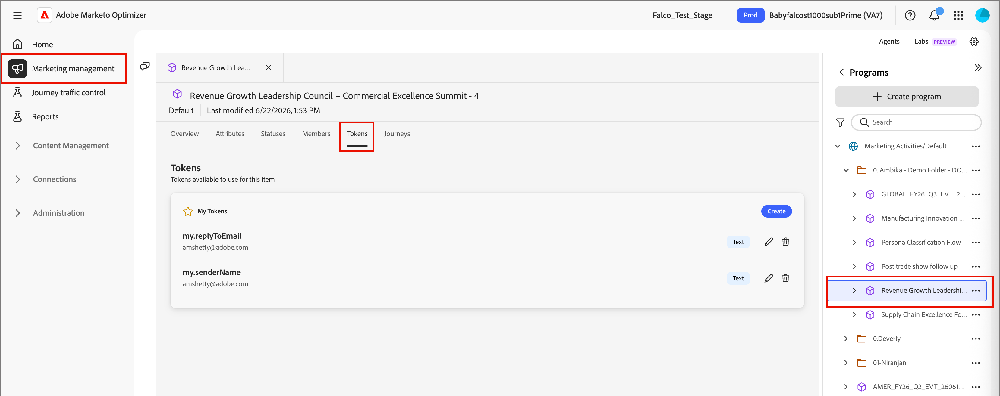
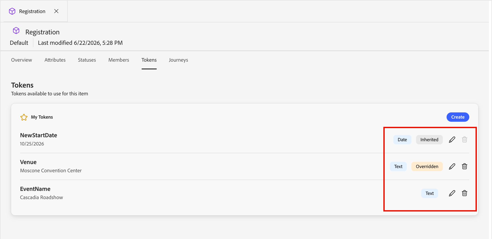
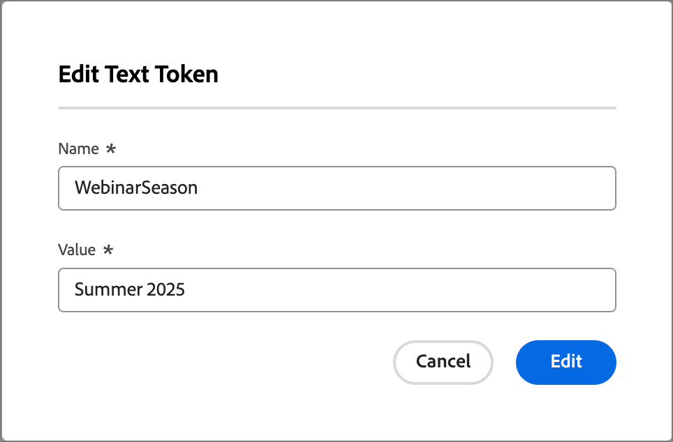

# Tokens personalizados para personalización

La personalización de contenido utiliza tokens como marcadores de posición o variables que se rellenan cuando se genera el artefacto de contenido. Los tokens de personalización estándar están disponibles para correos electrónicos, páginas de aterrizaje, fragmentos y plantillas. También puede definir un conjunto de tokens personalizados con valores específicos del programa o la carpeta. Este conjunto de tokens personalizados se denomina _Mis tokens_ y cualquiera de ellos es para personalización.

Cuando agrega un token personalizado a un correo electrónico, se muestra como `{{my.TokenName}}`. Por ejemplo, podría tener `{{my.EventDate}}` o `{{my.WebinarSpeaker}}` tokens creados para administrar el contenido de los correos electrónicos relacionados con los próximos seminarios web.

Además de _Mis tokens_, que son específicos del programa o la carpeta, puede usar cualquiera de los tokens estándar (integrados) para la personalización.

>[!NOTE]
>
>_Mis tokens_ no están habilitados actualmente en el editor de Personalization para esta versión de Beta.

## Tokens de acceso

1. En el panel de navegación izquierdo, expanda **[!UICONTROL Administración de mercadotecnia]**.

1. A la derecha de la lista de recursos de **[!UICONTROL Marketing]**, seleccione **[!UICONTROL Programas]**.

1. En la estructura de árbol, seleccione el programa o la carpeta para abrir los detalles en el espacio de trabajo central.

1. Haga clic en la ficha **[!UICONTROL Tokens]**.

   {width="800" zoomable="yes"}

   La pestaña muestra todos los tokens personalizados definidos dentro de la carpeta o programa, así como cualquier token definido para carpetas o programas principales.

### Tipos de token {#my-tokens}

Los _Mis tokens_ son variables personalizadas que se crean o modifican para un programa o carpeta. Este conjunto de tokens personalizados admite los siguientes tipos de tokens:

| Tipo de token | Descripción |
| ---------- | ----------- |
| Texto | Este tipo contiene una cadena de texto estándar. El límite de tamaño para los tokens de texto es de 524 288 caracteres (UTF-8) o 2 MB. |
| Fecha | Este tipo contiene un valor de fecha. La fecha se muestra como mes-día-año (por ejemplo, 23-9-2026). |
| Fecha y hora | Este tipo contiene un valor de fecha y hora. |
| Número | Este tipo contiene un valor entero estándar. |
| Correo electrónico | Este tipo contiene una dirección de correo electrónico válida. |
| Puntuación | Utilice este token para cambiar la puntuación de un nodo de acción de recorrido. |
| Booleano | Este tipo contiene un valor booleano estándar, true o false. |
| Texto enriquecido | Este tipo contiene texto con formato. |

### Anidado de tokens

Cuando se crea un token en un programa o una carpeta, está disponible para referencia por otros objetos secundarios.

* Token local: el token se define en el mismo programa o carpeta.
* Token heredado: el token se define en un programa o carpeta principal, uno o más niveles por encima del programa o la carpeta actual.
* Token anulado: el token se define en un programa o carpeta principal, pero se define un valor diferente en el programa o carpeta actual. El estado del token cambia a _Anulado_, y todas las carpetas, programas y artefactos de marketing secundarios heredan el nuevo valor.

{width="600" zoomable="yes"}

### Crear un token

1. En la ficha _[!UICONTROL Tokens]_, haga clic en **[!UICONTROL Crear]**.

1. En el cuadro de diálogo, escriba el **[!UICONTROL Nombre]** para el token.

   {width="400"}

   No se pueden utilizar espacios ni caracteres especiales en el nombre del token. Puede usar _minúscula_, como `EventType`, para usar un nombre de varias palabras que se identifique fácilmente.

1. Elija **[!UICONTROL Type]** para el token.

1. Establezca **[!UICONTROL Value]** para el token.

1. Haga clic en **[!UICONTROL Crear]**.

### Edición de un token

Puede editar el valor de cualquiera de los Mis tokens definidos. Haga esto para anular el valor de un token heredado.

<!-- (How does this affect live person journeys? ) -->

1. En _[!UICONTROL Tokens]_ , haga clic en el icono _Editar_ junto al nombre del token.

1. En el campo, cambie el valor según sea necesario.

   {width="400"}

1. Haga clic en el icono _Guardar_.

### Eliminación de un token

Puede eliminar un token personalizado de la lista si actualmente no se utiliza en el contenido del correo electrónico de recorrido.

1. En _[!UICONTROL Tokens]_ , haga clic en el icono _Delete_ junto al nombre del token.

1. En el cuadro de diálogo de confirmación, haga clic en **[!UICONTROL Eliminar]**.

<!--

## Use custom tokens in your content

When you are authoring email content for your programs, you can use any of the tokens from the _My Tokens_ list when you use the personalization tools in the visual design space.

1. Select the text component and click the _Add personalization_ (  ) icon in the toolbar.

   {width="600"}

   This action opens the _Edit Personalization_ dialog. The dialog includes a _[!UICONTROL My tokens]_ folder in the _[!UICONTROL Personalization Tokens]_ library if there are custom tokens defined for the account journey.

1. To add one of your custom tokens to the blank space, expand the **[!UICONTROL My tokens]** folder, then click **+** or **...**.

   You can add any additional static text as needed.

   {width="700" zoomable="yes"}

1. Click **[!UICONTROL Save]**.

-->
