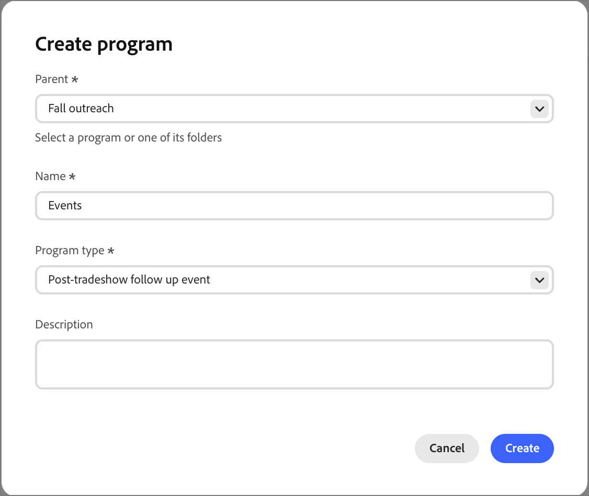

# Programas

Los programas están diseñados para dar un contexto compartido a sus materiales promocionales y recorridos de marketing, de modo que pueda administrar todos los aspectos de un esfuerzo de marketing desde un solo lugar. Use los atributos del programa para describir el programa y el filtro _Miembro del programa_ para segmentar audiencias en función de la pertenencia al programa, el estado de miembro y el éxito. Desde la pestaña Tokens, puede administrar _Mis tokens_ locales y los tokens que se heredan en la estructura de carpetas.

## Acceso a programas {#access-programs}

Cada programa se encuentra en la estructura de carpetas _[!UICONTROL Marketing]_ y puede contener recorridos, listas y otros recursos para organizar las actividades de marketing.

1. En el panel de navegación izquierdo, expanda **[!UICONTROL Administración de mercadotecnia]**.

1. A la derecha de la lista de recursos de **[!UICONTROL Marketing]**, seleccione **[!UICONTROL Programas]**.

1. Utilice las herramientas _Buscar_ y _Filtrar_ para encontrar elementos dentro de la estructura.

1. Seleccione un programa o una carpeta de la estructura para abrir sus detalles en el espacio de trabajo central.

   {width="800" zoomable="yes"}

   Seleccione cualquiera de las pestañas para acceder a los detalles o el contenido del programa o la carpeta.

## Creación de un programa {#create-program}

>[!IMPORTANT]
>
>Cada programa se basa en un [tipo de programa](../admin/program-types.md), que define aspectos importantes del programa y sus miembros. Asegúrese de tener definido un tipo de programa para admitir el programa antes de crearlo.

1. Haga clic en **[!UICONTROL Crear programa]** en la parte superior de la estructura del árbol de programas.

1. En el cuadro de diálogo, seleccione la ubicación **[!UICONTROL Principal]** dentro de la estructura Programas.

   Puede ser la raíz, una carpeta o un programa existente.

1. Escriba un **[!UICONTROL Nombre]** único (obligatorio).

   {width="400"}

1. Elija **[!UICONTROL Tipo de programa]**, que determina los atributos del programa y los estados de miembros.

1. (Opcional) Escriba una **[!UICONTROL Descripción]** para el programa.

   >[!TIP]
   >
   >Incluir una descripción es una práctica recomendada y hace que los programas sean más accesibles y reconocibles.

1. Haga clic en **[!UICONTROL Crear]**.

## Atributos {#attributes}

Cada programa hereda un conjunto de atributos de su [tipo de programa](../admin/program-types.md). Utilice atributos para describir los aspectos importantes de los programas de marketing, como las fechas de los eventos y los atributos de ubicación.

>[!NOTE]
>
>Después de Beta: Atributos de programa como tokens y como miembro de restricciones de programa

## Estados {#statuses}

Cada programa hereda un conjunto de estados miembros de su tipo de programa. Estos estados se pueden asignar a miembros del programa para su uso en la segmentación de audiencia con el filtro Miembro del programa.

Cada estado se asigna a un paso en el tipo de programa, como 1, 2 o 3. Los miembros de un programa solo pueden pasar de un estado con el mismo número de paso (por ejemplo, de _No mostrado_ a _Asistido_) o a un estado con un número de paso superior (por ejemplo, de _Invitado_ a _Registrado_).

En el tipo de programa, los estados en los que se ha seleccionado _[!UICONTROL Marcar como correcto]_ se consideran correctos.

### Cambiar el estado del programa {#change-program-status}

Para agregar a una persona a un programa o cambiar su estado, debe pasar una **_[!UICONTROL acción Cambiar estado del programa]_** [en un recorrido](./action-nodes.md). Esto los convierte en miembros del programa y les asigna un estado en ese programa.

### Corregir un estado de programa {#correct-program-status}

Si las personas han sido asignadas a un estado por error y no se pueden mover hacia adelante o lateralmente al estado correcto, puede corregir esto si primero establece la persona en _No está en el programa_ y, a continuación, establece el estado correcto.

## Miembros {#members}

La ficha **Miembros** muestra un inventario de las personas que son miembros del programa.

<!-- How do they get there? I don't see this populated for any of the programs that I have reviewd -->

## Tokens {#tokens}

Use _Mis tokens_ para administrar fácilmente los detalles del programa que aparecen en muchos lugares, como fechas y ubicaciones de eventos, pies de página de correos electrónicos, años y trimestres fiscales, etc. Estos tokens específicos del programa son cadenas especiales diseñadas para reutilizarse en recorridos o recursos de marketing con el fin de sustituir un valor predeterminado. Por ejemplo:

_Se le ha invitado a asistir a nuestra exposición el `{{my.Event Date}}`._

Si envía este correo electrónico a través de un recorrido en un programa con un _Fecha del evento_ Mi token establecido en `2026-01-01`, el destinatario verá:

_Se le ha invitado a asistir a nuestra exposición el 1 de enero de 2026._

Mis tokens también se pueden asignar en el nivel de carpeta. Las carpetas y los programas heredan todos los tokens My definidos para un elemento principal del árbol. Se puede anular un token heredado si se define un valor diferente para el mismo token en un nivel inferior. Por ejemplo, puede definir un pie de página de correo electrónico en la parte superior de la estructura de carpetas, pero cambiar el idioma de copyright de un evento de marketing conjunto con un socio, o cambiar la dirección URL de un banner promocional para un programa específico de un producto.

Para obtener más información sobre cómo definir y usar Mis tokens, consulte [tokens personalizados para personalización](./personalization-my-tokens.md).

## Miembro del filtro de Programa {#member-of-program}

_Miembro del programa_ es un filtro que le permite segmentar las listas dinámicas en función de si alguien es miembro de un programa, en qué estado se encuentra y si tiene éxito en ese programa. Tenga cuidado al usar las restricciones **_Program_** y **_Status_** juntas: use tipos coincidentes con los programas que usa para los filtros; de lo contrario, podría crear de forma involuntaria una audiencia que no puede tener miembros.
