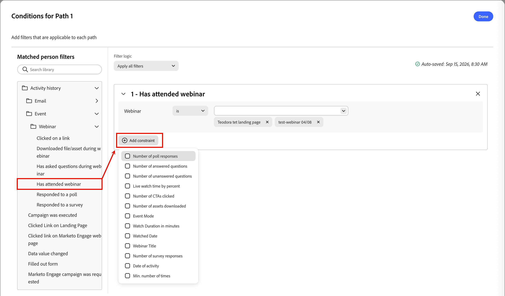

# Dividir y combinar nodos de rutas

Utilice los nodos de rutas de acceso divididas y combinadas en recorridos de persona para segmentar a las personas en rutas distintas en función de las condiciones definidas y, a continuación, combine esas rutas para que el recorrido pueda continuar. Las rutas divididas permiten adaptar las acciones y los eventos a segmentos de audiencia específicos, mientras que las rutas de combinación combinan esos segmentos en un punto común.

## Dividir nodos de rutas

Utilice los nodos divididos para segmentar a las personas según las condiciones que defina. Cree rutas para la lista de audiencias según las condiciones, defina cada ruta con nodos de acción y evento para el segmento y, a continuación, combine las rutas y continúe con el recorrido.

Un nodo de Rutas divididas define una o más rutas segmentadas en función de los filtros de personas.

<!-- A split based on a people filter is automatically closed with a merge paths node so that all people can move forward to the next step. Split by people paths can include only people actions. These paths cannot be split again and automatically join back. _not currently true_ -->

_&#x200B;**Funcionamiento de un nodo de ruta dividida**&#x200B;_

* La evaluación de cada ruta es de arriba abajo. Si una persona coincide con la primera y la segunda ruta, solo seguirá la primera ruta.
* El nodo admite la definición de una ruta de acceso de _Otras personas_, donde puede agregar acciones o eventos para las personas que no coincidan con uno de los segmentos o rutas definidos.

### Filtros de personas coincidentes

Para cada ruta que defina para el nodo, utilice los siguientes tipos de filtro para hacer coincidir personas según una o más condiciones.

| Filtros | Descripción |
| ------- | ----------- |
| Historial de actividad | Actividades basadas en condiciones que se evalúan utilizando uno o más elementos seleccionados |
| Brand Concierge | Actividades para posibles clientes que interactúan con [!DNL Brand Concierge]. |
| Atributos de la compañía | Atributos del perfil de empresa/cuenta, incluidos: <li>Ingresos anuales <li>Nombre de la compañía <li>País de facturación <li>Industria <li>Cantidad de empleados <li>Código SIC <li>Estado |
| Datos de intención | Atributos basados en datos de intención asociados al perfil de la persona. |
| Oportunidades | Atributos basados en las oportunidades asociadas con el perfil de la persona. |
| Atributos de la persona | Atributos del perfil de persona B2B, incluidos: <li>Ciudad <li>País <li>Fecha de nacimiento <li>Dirección de correo electrónico <li>Email no válido <li>Email suspendido <li>Nombre <li>Región del estado inferida<li>Cargo <li>Apellido <li>Número de teléfono móvil <li>Puntuación de participación de personas <li>Número de teléfono <li>Código postal <li>Estado <li>Suscripción cancelada <li>Razón de la cancelación de la suscripción |
| Aplicaciones de ventas | Actividades de posibles clientes relacionadas con [!DNL Sales Qualifier] o [!DNL Marketo Sales Insights]. |
| Filtros especiales | Filtrado de atributos que no se incluyen en las categorías predefinidas, lo que proporciona flexibilidad para criterios de filtro personalizados o diversos. |

>[!BEGINSHADEBOX]

**Actividades [!DNL Marketo Optimizer] compatibles con los filtros de condición**

Para las condiciones de ruta de acceso, [!DNL Marketo Optimizer] admite actividades de la instancia [!DNL Marketo Engage] que está conectada como origen de datos.

>[!NOTE]
>
>Solo puede haber una instancia de [!DNL Marketo Engage] como origen de datos y está preconfigurada en el momento del aprovisionamiento de la instancia de [!DNL Marketo Optimizer].

Puede generar condiciones en torno a las siguientes [!DNL Marketo Engage] actividades:

* [!UICONTROL Se ha completado el formulario de Marketo Engage]. Coincide con los posibles clientes que han completado un formulario [!DNL Marketo Engage] específico en cualquier momento de su registro de actividades que no hayan caducado.
* [!UICONTROL Visitó la página web de Marketo Engage]. Coincide con los posibles clientes que vieron una dirección URL específica en su sitio web o en [!DNL Marketo Engage] páginas de aterrizaje. Funciona directamente mediante el código de seguimiento de Munchkin instalado en el sitio.
* [!UICONTROL Se hizo clic en un vínculo en la página web de Marketo Engage]. Coincide con los posibles clientes que han hecho clic en un vínculo o recurso específico de una página rastreada.
* [!UICONTROL Se envió el correo electrónico de Marketo Engage]. Coincide con los posibles clientes a los que [!DNL Marketo Engage] intentó enviar un correo electrónico específico, teniendo en cuenta las acciones de implementación anteriores a las devoluciones graves o las aceptaciones del servidor.
* [!UICONTROL Se entregó el correo electrónico de Marketo Engage]. Coincide con un posible cliente cuyo servidor de correo (MX) devolvió una respuesta correcta (un mensaje 250 OK) al servidor emisor [!DNL Marketo Engage].
* [!UICONTROL Correo electrónico de Marketo Engage rechazado] - Coincide con posibles clientes que experimentaron un rechazo grave (error de envío permanente) en un envío de correo electrónico específico o dentro de un intervalo de tiempo.
* [!UICONTROL El correo electrónico de Marketo Engage rebotó de forma suave]. Coincide con los posibles clientes cuyos correos electrónicos experimentaron un error de entrega temporal (como una bandeja de entrada completa o un servidor sin conexión) en lugar de un rebote duro permanente.
* [!UICONTROL Se canceló la suscripción al correo electrónico de Marketo Engage]. Coincide con los posibles clientes que se excluyeron de los correos electrónicos de marketing no operativos. Cuando esto sucede, [!DNL Marketo Engage] actualiza automáticamente el valor de campo `Unsubscribed` del posible cliente a `true`, lo que los suprime de futuros envíos de correo electrónico estándar.
* [!UICONTROL Correo electrónico de Marketo Engage abierto] - Coincide con los posibles clientes que abrieron un correo electrónico de [!DNL Marketo Engage] rastreado.
* [!UICONTROL Se hizo clic en un vínculo en el correo electrónico de Marketo Engage]. Coincide con los posibles clientes que hicieron clic en un vínculo (o en un vínculo específico) incluido en un correo electrónico de [!DNL Marketo Engage].

>[!ENDSHADEBOX]

### Adición de un nodo de rutas divididas

1. Navegue hasta el lienzo de recorrido.

1. Haga clic en el icono de signo más ( **+** ) en una ruta y elija **[!UICONTROL Dividir rutas]**.

   {width="200"}

1. Para definir una condición aplicable a _[!UICONTROL Ruta 1]_, haga clic en **[!UICONTROL Aplicar condición]**.

1. Para definir la ruta dividida, añada uno o más filtros en el editor de condiciones.

   * Arrastre y suelte cualquiera de los filtros de personas desde la navegación izquierda y complete la definición de la coincidencia.

   * Haga clic en **[!UICONTROL Agregar restricción]** para cada restricción que desee usar para restringir la coincidencia de filtros.

     {width="700" zoomable="yes"}

   * Refine las condiciones aplicando la **[!UICONTROL lógica de filtro]** en la parte superior. Puede elegir hacer coincidir todas las condiciones o cualquier condición.

   * Haga clic en **[!UICONTROL Finalizado]**.

1. Para agregar más rutas, haga clic en **[!UICONTROL Agregar ruta]** y repita los pasos anteriores para agregar las condiciones aplicables a la ruta.

   También puede etiquetar cada ruta en función de estas condiciones o utilizar las etiquetas predeterminadas.

1. Si es necesario, reordene las rutas según la prioridad que desee para la división.

   El filtrado de rutas se evalúa en orden descendente. Cada persona continúa por el primer camino que coincida.

   Haga clic en las flechas arriba y abajo en la parte superior derecha de cada tarjeta de ruta para moverla hacia arriba o hacia abajo en la lista de rutas.

   <!-- {width="500" zoomable="yes"} -->

1. Habilite la opción **[!UICONTROL Otras personas]** para agregar una ruta predeterminada para las personas que no coinciden con las rutas definidas.

   Cuando esta opción no está habilitada, las personas que no coinciden con un segmento o ruta definida pasan la división y continúan con el siguiente paso del recorrido.

Cuando haya definido condiciones para cada ruta, puede añadir nodos de acción o de evento que desee aplicar a las personas de una ruta.

## Combinar nodos de rutas

1. Vaya al lienzo de recorrido y busque el nodo de rutas divididas con dos o más rutas.

   Cada ruta debe tener una combinación de nodos de acción y de evento.

1. Haga clic en el icono de signo más ( **+** ) al final de cualquiera de estas rutas y elija **[!UICONTROL Combinar rutas]** entre las opciones que se muestran.

1. En las propiedades del nodo a la derecha, seleccione las rutas que desee combinar.

   <!-- {width="600" zoomable="yes"} -->

   En este punto, las rutas se combinan para que las personas de las rutas seleccionadas se combinen en una sola ruta que pueda continuar avanzando a través del recorrido.

1. Si es necesario, puede anular la combinación de rutas volviendo a las propiedades del nodo de rutas de combinación y desactivando la casilla de verificación de las rutas que desee eliminar.