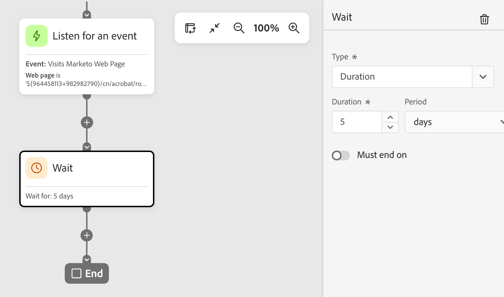
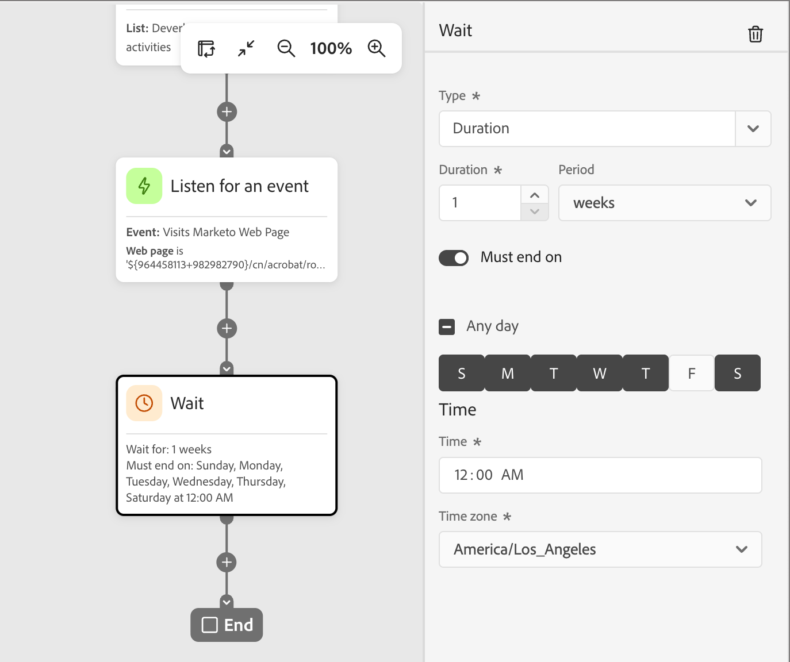

# Nodo de espera

Use un nodo _Wait_ cuando desee pausar la progresión del recorrido durante un tiempo determinado antes de pasar al siguiente paso.

Existen dos formas de definir el tiempo de espera:

* Una fecha específica en la que desea avanzar al siguiente nodo del recorrido
* Una duración relativa (cantidad de minutos, horas, días, semanas o meses)

## Añadir el nodo de espera {#add-wait-node}

1. Navegue hasta el lienzo de recorrido.

1. Haga clic en el icono de signo más ( **+** ) en una ruta y elija **[!UICONTROL Esperar]**.

   {width="200"}

1. Para establecer el tiempo de espera antes de que el recorrido continúe con el siguiente nodo en la ruta de acceso, use las propiedades del nodo a la derecha para establecer **[!UICONTROL Type]**.

   * **[!UICONTROL Duración]**: defina un número específico de días, horas o minutos entre la entrada y la salida del nodo de espera.
   * **[!UICONTROL Fecha]** - Especifique una fecha y hora para la salida.

   {width="500"}

## Configuración de espera avanzada {#advanced-wait-settings}

Habilite la opción **[!UICONTROL Debe finalizar el]** para configurar un _paso de espera avanzado_ y garantizar que los mensajes lleguen a las personas y a los miembros de la cuenta en el momento óptimo. Esta configuración le proporciona un control preciso sobre cuándo una persona o cuenta sale de un paso de espera y pasa al siguiente nodo de la recorrido. En lugar de un número fijo de horas o días desde la entrada hasta la salida, puede programar acciones para que se produzcan en momentos específicos y en días específicos de la semana.

Con un _paso de espera avanzado_, usted define **_cuándo_** sale la persona o cuenta, no simplemente cuánto tiempo esperan.

{width="500"}

### Tipos de espera {#wait-types}

| Tipo de espera | Descripción | Configuración |
| --------- | ----------- | ------------- |
| **Hora específica del día** | Mantener hasta una hora específica (por ejemplo, 9:00 a.m.) | Establezca la hora (hora y minuto). Sale en la siguiente incidencia de esa hora (para la zona horaria seleccionada). |
| **Día específico de la semana** | Retener hasta un día en particular (por ejemplo, el martes) | Seleccione un día de la semana. Si no se especifica ninguna hora, sale a medianoche (para la zona horaria seleccionada) del siguiente día coincidente. |
| **Intervalo o combinación de días** | Mantener hasta cualquier día dentro de un intervalo (como lunes a viernes) o en cualquiera de los días especificados | Seleccione los días de destino. Si no se especifica ninguna hora, sale a medianoche (para la zona horaria seleccionada) del siguiente día coincidente. |
| **Combinación de tiempo + día** | Combine ambos para una programación precisa (como los martes a las 10:00 a.m.) | Seleccione los días objetivo y establezca la hora objetivo. Sale en la incidencia de día/hora siguiente (para la zona horaria seleccionada). |

### Casos comunes {#common-scenarios}

Los siguientes escenarios ilustran cómo se pueden aplicar ejemplos típicos a la configuración del nodo de espera:

+++Llegada por correo electrónico durante el horario laboral

**Escenario:** Vende a clientes B2B que leen correos electrónicos durante su jornada laboral. Desea que todos los correos electrónicos lleguen durante el horario laboral.

**Solución:** configure su paso de espera para liberar posibles clientes a las 9:00 a.m. en días laborables (de lunes a viernes). Independientemente de cuándo un posible cliente entre en el nodo de espera, recibirá el correo electrónico durante el horario laboral.

+++

+++Tiempos de envío coherentes para audiencias dinámicas

**Escenario:** Su audiencia cambia a diario conforme califican nuevas cuentas o posibles clientes. Desea que todos los posibles clientes reciban el primer correo electrónico al mismo tiempo, independientemente de cuándo cumplan los requisitos.

**Solución:** configure el paso de espera para que finalice a una hora específica (por ejemplo, a las 10:00 a.m.). Todos los posibles clientes, tanto si se clasificaron a medianoche como al mediodía, salen juntos del paso de espera a las 10:00 a.m.

+++

+++Tareas de seguimiento compatibles con SLA

**Escenario:** su equipo de ventas tiene un SLA de dos días hábiles para hacer un seguimiento de los posibles clientes de las cuentas calificadas para mercadeo. Se excluyen los fines de semana.

**Solución:** configure el paso de espera para liberar posibles clientes solo en días laborables. Una ventaja clasificada el viernes se dirige para el seguimiento el lunes o el martes, no durante el fin de semana.

+++

### Ejemplos de entrada y salida {#entry-exit-examples}

| Configuración de espera | Ingresantes de cuenta/posible cliente | Salidas de cuenta/posible cliente |
| ------------------ | ------------------- | ------------------ |
| 9:00 a. m., cualquier día | Lunes 11:00 | Martes, 9:00 |
| 9:00 a. m., cualquier día | Lunes, 7:00 | Lunes, 9:00 |
| Martes, no hay tiempo establecido | Viernes 3:00 PM | Martes 12:00 |
| 10:00 AM, de lunes a viernes | Sábado 2:00 PM | Lunes 10:00 |
| 10:00 AM, de lunes a viernes | Miércoles, 8:00 | Miércoles 10:00 |
