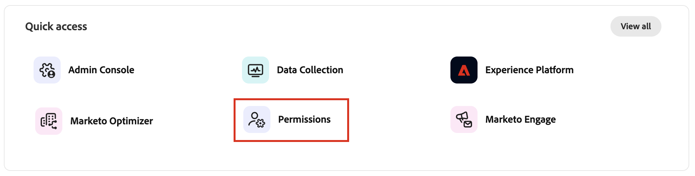
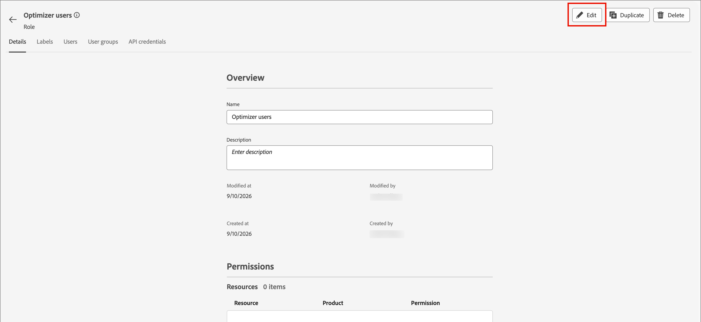

# Acceso y permisos de usuario

Una vez completado el aprovisionamiento y enlazados los entornos limitados, complete los siguientes pasos para proporcionar acceso de [!DNL Marketo Optimizer] a su equipo y a los usuarios.

1. [Crear un [!DNL Marketo Optimizer] perfil de producto](#create-profile) en Admin Console (solo configuración inicial/única).
1. [Agregar un grupo de usuarios](#add-user-group) en Admin Console.
1. [Asigne el perfil de producto](#assign-profile) al grupo de usuarios en Admin Console.
1. [Agregar usuarios al nuevo grupo](#add-users) en Admin Console.
1. [Edite las funciones integradas](#edit-role-permissions) o [cree una función personalizada](#create-a-custom-role) con permisos de producto y la zona protegida [!DNL Marketo Optimizer] requerida en Experience Platform.
1. [Agregar usuarios](#add-users-to-a-role) o [grupos](#add-user-groups-to-a-role) a los roles de Adobe Experience Platform.

## Configuración del perfil del producto {#config-profile}

Como administrador, puede completar estas tareas en [!DNL Adobe Admin Console], que es un lugar central para administrar las licencias y los usuarios de productos de Adobe. En Admin Console, puede crear y administrar usuarios en una sola ubicación en lugar de en las distintas soluciones individuales. Para obtener más información sobre sus funciones y capacidades, consulte la página [Información general de Admin Console](https://helpx.adobe.com/es/business/enterprise/deploy-apps-updates.html).

### Acceso a Admin Console {#admin-console}

Antes de poder usar Admin Console para administrar usuarios dentro de su equipo, debe asegurarse de que puede acceder a Admin Console y de que dispone de los permisos adecuados.

1. Como administrador del sistema, debe recibir varios correos electrónicos de Adobe como parte del proceso de incorporación.

   Busque el correo electrónico de bienvenida que proporciona la información sobre el nombre de la organización a la que se le ha concedido acceso.

1. Haga clic en el vínculo **[!UICONTROL Introducción]** del correo electrónico de bienvenida para ir a Admin Console.

   Si no encuentra el correo electrónico, abra un explorador directamente en Admin Console en [https://adminconsole.adobe.com](https://adminconsole.adobe.com).

1. Inicie sesión con su Adobe ID.

   Una vez que inicie sesión correctamente, verá la página _Información general_ de Adobe Admin Console.

1. Si tiene acceso a varias organizaciones, asegúrese de haber iniciado sesión en la organización correcta.

   Para cambiar su organización, haga clic en el nombre de la organización en la esquina superior derecha y seleccione la organización a la que necesita acceder.

1. Seleccione **[!UICONTROL Administradores]** de la tarjeta _[!UICONTROL Usuarios]_ para comprobar que es administrador del sistema.

   {width="800" zoomable="yes"}

1. Busque introduciendo su correo electrónico, nombre de usuario, nombre o apellidos de Adobe ID.

   * Si el acceso está configurado correctamente, la búsqueda devolverá el registro.

   * Si el valor de la columna **[!UICONTROL ROL DE ADMINISTRADOR]** muestra `System`, sabrá que usted (o el usuario mostrado) es administrador del sistema.

### Crear el perfil de producto [!DNL Marketo Optimizer] {#create-profile}

Al conceder a los usuarios acceso a una solución de Adobe, no necesariamente desea darles acceso completo. Los perfiles de producto permiten que cada solución tenga su propio conjunto de permisos de usuario. Utilice Admin Console para asignar perfiles de producto.

Para obtener más información sobre el uso de perfiles de producto para las autorizaciones de usuario, consulte [_Administrar perfiles de producto para usuarios empresariales_](https://helpx.adobe.com/es/business/enterprise/products-entitlements/manage-product-profiles/product-profiles.html){target="_blank"} en la documentación de Admin Console.

{width="30"} Un administrador del sistema o [!DNL Experience Platform] administrador de productos puede realizar los siguientes pasos desde [https://adminconsole.adobe.com](https://adminconsole.adobe.com).

1. Seleccione la ficha **[!UICONTROL Productos]**.

1. Abra la instancia [!DNL Marketo Optimizer] en la que desee agregar el perfil y haga clic en **[!UICONTROL Nuevo perfil]**.

1. Escriba un nombre de perfil de producto, como _Acceso_.

1. Haz clic en **[!UICONTROL Siguiente]** y luego en **[!UICONTROL Guardar]**.

### Agregar un grupo de usuarios {#add-user-group}

Un grupo de usuarios es una colección de usuarios a los que se concede un conjunto compartido de permisos. Puede agregar o quitar usuarios de su grupo de usuarios. Los permisos del grupo siguen siendo los mismos mientras cambian los usuarios dentro del grupo.

Para obtener más información sobre cómo se usan los grupos de usuarios para administrar permisos, consulte [Administrar grupos de usuarios](https://helpx.adobe.com/es/business/enterprise/users/users-and-groups/user-groups.html){target="_blank"} en la documentación de Admin Console.

{width="30"} Un administrador del sistema puede realizar los siguientes pasos desde [https://adminconsole.adobe.com](https://adminconsole.adobe.com).

1. Seleccione la ficha **[!UICONTROL Usuarios]**.

1. Elija **[!UICONTROL grupos de usuarios]** en el panel de navegación izquierdo.

1. Haga clic en **[!UICONTROL Nuevo grupo de usuarios]** en la parte superior derecha.

1. Escriba un nombre para el grupo de usuarios, como _usuarios de Optimizer_ y haga clic en **[!UICONTROL Guardar]**.

   {width="600" zoomable="yes"}

### Asignar el perfil de producto {#assign-profile}

{width="30"} Un administrador de productos puede realizar los siguientes pasos desde [https://adminconsole.adobe.com](https://adminconsole.adobe.com).

1. Haga clic en el grupo de usuarios que ha creado.

1. Seleccione la ficha **[!UICONTROL Perfiles de producto asignados]** y haga clic en **[!UICONTROL Asignar perfil]**.

1. Haga clic en **+** y agregue cada instancia de los siguientes productos:

   * [!UICONTROL Adobe Marketo Optimizer - Acceso]
   * [!UICONTROL Adobe Experience Platform - AEP-Default-All-Users]
   * [!UICONTROL Recopilación de datos de Adobe Experience Platform - Acceso a todos los datos de recopilación predeterminada]
   * [!UICONTROL Adobe Experience Platform - Acceso a todos los equipos de producción predeterminado]

   {width="600" zoomable="yes"}

1. Haga clic en **[!UICONTROL Guardar]**.

### Agregar usuarios al nuevo grupo {#add-users}

Para obtener información acerca de la administración de usuarios, consulte [_Usuarios de Adobe Admin Console_](https://helpx.adobe.com/es/business/enterprise/users/understand-user-management/user-management-overview.html){target="_blank"} en la documentación de Admin Console.

{width="30"} Un administrador del sistema o de producto puede realizar los siguientes pasos desde [https://adminconsole.adobe.com](https://adminconsole.adobe.com). Un administrador de productos solo puede agregar usuarios que ya existen en su organización.

1. Si los usuarios aún no son miembros de su organización, agregue cada usuario:

   * En _[!UICONTROL Vínculos rápidos]_, haga clic en **[!UICONTROL Agregar usuarios]**.

   * Escriba la dirección de correo electrónico del usuario y haga clic en **[!UICONTROL Agregar como nuevo usuario]**.

     {width="600" zoomable="yes"}

   * Escriba el nombre y los apellidos y, a continuación, haga clic en **[!UICONTROL Guardar]**.

1. Añada cada usuario al grupo:

   * Haga clic en el nombre de usuario.

   * En la página de detalles del usuario, desplácese hasta **[!UICONTROL grupos de usuarios]**.

   * Haga clic en el icono _Más_ ( **...** ) de la izquierda y elija **[!UICONTROL Editar grupos de usuarios]**.

   * Haga clic en el icono _Agregar_ ( **+** ) debajo de **[!UICONTROL Grupos de usuarios]**.

     {width="600" zoomable="yes"}

   * Seleccione el grupo de usuarios que creó anteriormente y haga clic en **[!UICONTROL Aplicar]**.

   * Haga clic en **[!UICONTROL Guardar]** para ver los cambios del usuario.

## Asignar permisos de producto {#assign-product-permissions}

Los permisos son derechos unitarios que le permiten definir las autorizaciones asignadas a un perfil de producto. Cada permiso se agrupa en una funcionalidad, como recorridos de persona o contenido, que representa las funcionalidades de [!DNL Marketo Optimizer].

El área _Permisos_ de Adobe Experience Platform es donde los administradores pueden definir roles de usuario y directivas de acceso para administrar permisos de acceso para características y objetos dentro de una aplicación de producto. En esta aplicación, puede crear y administrar funciones, así como asignar los permisos de recursos deseados para estas. Los permisos también le permiten administrar los entornos limitados y los usuarios asociados a una función específica.

Para obtener más información sobre los permisos de funciones en Experience Platform, consulte [Administrar permisos para una función](https://experienceleague.adobe.com/es/docs/experience-platform/access-control/abac/permissions-ui/permissions){target="_blank"} en la documentación de Experience Platform.

1. Vaya a [experience.adobe.com](https://experience.adobe.com/).

1. En el panel _[!UICONTROL Acceso rápido]_, seleccione **[!UICONTROL Permisos]**.

   >[!NOTE]
   >
   >Si no ve _[!UICONTROL Permisos]_, es posible que tenga que hacer clic en **[!UICONTROL Ver todos]** y seleccionarlo entre las aplicaciones disponibles.

   {width="700" zoomable="yes"}

### Recursos de permisos {#permissions}

Los siguientes recursos de permiso controlan el acceso a las características de configuración de canal, administración de contenido y recorrido personal de [!DNL Marketo Optimizer]:

>[!IMPORTANT]
>
>El acceso a [!DNL Marketo Optimizer] requiere que habilite una zona protegida específica que esté aprovisionada con la siguiente convención de nombres: `Mktoaep` + prefijo de suscripción de [!DNL Marketo Engage]. Por ejemplo, si el prefijo de suscripción [!DNL Marketo Engage] vinculado es _AcmeAssoc_, la zona protegida necesaria para el acceso de [!DNL Marketo Optimizer] es _MktoaepAcmeAssoc_.

| Categoría | Permiso | Descripción |
| -------- | ----------- | ---------- |
| Configuraciones de canal B2B | Ver configuración de correo electrónico B2B | Ver la configuración de correo electrónico (subdominios, registros PTR, grupos de IP, listas de supresión, listas de semilla, planes de calentamiento de IP). |
| | Administrar configuración de correo electrónico B2B | Configure las opciones de correo electrónico (subdominios, registros PTR, grupos de IP, listas de supresión, listas de semilla, planes de calentamiento de IP). Esta configuración es necesaria para que los usuarios puedan enviar correos electrónicos. |
| | Administrar configuraciones de canales B2B | Acceso al elemento de menú _Canales_ en la navegación izquierda y todas las operaciones de configuración de canal. |
| | Administrar ajustes preestablecidos de WhatsApp B2B | Cree, vea y elimine ajustes preestablecidos de mensajes de WhatsApp y ajustes de SMS asociados. |
| Recorridos B2B | Administrar Recorridos de persona B2B | Acceso a la lista _Recorridos de personas_ y a todas las operaciones de recorrido de personas. |
| Assets B2B | Ver plantillas de contenido | Ver lista y detalles de plantillas de contenido. |
| | Administrar plantillas B2B | Cree, edite y elimine plantillas de contenido. |
| | Ver fragmentos B2B | Ver lista y detalles de fragmentos de contenido. |
| | Administrar fragmentos B2B | Crear, editar y eliminar fragmentos de contenido. |
| | Publicar fragmentos B2B | Publique fragmentos de contenido para utilizarlos en plantillas, correos electrónicos y páginas de aterrizaje. |
| | Ver Assets B2B | Vea los detalles de la biblioteca Assets y el archivo de recursos. |
| | Administración de Assets B2B | Cree, edite y elimine archivos de recursos. |
| | Ver correos electrónicos B2B | Ver mensajes de correo electrónico. |
| | Administración de correos electrónicos B2B | Crear, editar y eliminar mensajes de correo electrónico. |
| | Administrar exportación de mensajes B2B | Exporte informes de mensajes en la sección Correo electrónico. |
| Biblioteca de Journey Optimizer | Administrar elementos de biblioteca B2B | Añada y elimine expresiones guardadas en la biblioteca. |
| Gobernanza de datos | Administrar etiquetas de eliminación de uso B2B | Ver, crear y eliminar etiquetas de uso de datos (DULE) aplicadas a conjuntos de datos y esquemas. |
| Administración de zona protegida | Administración de paquetes B2B | Crear, exportar, importar, copiar y eliminar paquetes de zonas protegidas. |

Para proporcionar compatibilidad con destinos externos en [!DNL Marketo Optimizer], se requieren los siguientes permisos:

| Categoría | Permiso | Descripción |
| -------- | ----------- | ---------- |
| Paneles de control | Ver paneles estándar | Acceso de solo vista a los paneles de _Perfiles_, _Destinos_ y _Segmentos_. También habilita el acceso a _Paneles_ en la navegación izquierda y a la pestaña de inventario e integraciones de _Paneles_. |
| | Administrar paneles estándar | Agregue atributos personalizados que aún no estén en el almacén de datos. |
| Destinos | Ver destinos | Acceso de solo lectura para ver los destinos disponibles en la ficha _Catálogo_ y los destinos autenticados en la ficha _Examinar_. |
| | Administrar destinos | Ver, crear y eliminar destinos, conexiones y cuentas de destino. |
| | Activar destinos | Activar datos en destinos activos. También se requiere _Ver destinos_ o _Administrar destinos_ para acceder a esta función. |
| | Activar segmento sin asignación | Activar audiencias en destinos existentes, sin mostrar el paso de asignación. Los usuarios pueden agregar y eliminar audiencias en flujos de trabajo de activación, pero no pueden agregar ni eliminar atributos o identidades asignados. El permiso _Ver destinos_ también es necesario para tener acceso a esta función. |
| | Administrar y activar el destino del conjunto de datos | Ver, crear, editar y deshabilitar flujos de exportación de conjuntos de datos, así como activar datos en conjuntos de datos activos. El permiso _Ver destinos_ también es necesario para tener acceso a esta función. |
| | Creación de destino | Capacidad para crear destinos mediante Adobe Experience Platform Destination SDK. |
| Gobernanza de datos | Ver directivas de uso de datos | Acceso de solo vista para políticas de uso de datos que pertenecen a su organización. |
| | Administrar políticas de uso de datos | Ver, crear, editar y eliminar políticas de uso de datos. |
| Ingesta de datos | Ver orígenes | Acceso de solo vista a orígenes disponibles en la ficha _Catálogo_ y orígenes autenticados en la ficha _Examinar_. |
| | Administrar fuentes | Ver, crear, editar y deshabilitar orígenes. |
| Administración de perfiles | Ver configuración del perfil | Acceso de solo vista a todas las configuraciones de perfil. |
| | Administrar configuración de perfil | Ver y editar todas las configuraciones de perfil. |

<!--

### B2B built-in roles {#b2b-built-in-roles}

When your organization has [!DNL Marketo Optimizer] provisioned, Experience Platform includes a set of built-in (default, read-only) roles that you can use to manage access to the product capabilities:

| Role | Permissions |
| ---- | ----------- |
| B2B Journey Manager | <li>Manage B2B Journeys <li>Manage B2B Buying Groups <li>Manage B2B Account Lists <li>View B2B Engagement Dashboard <li>View B2B Insights Dashboard |
| B2B Channel Manager | <li>Manage B2B Assets <li>Manage B2B Templates <li>Manage B2B Fragments |
| B2B System Administrator | <li>Manage B2B Channels Configurations <li>Manage B2B Admin Configurations |

-->

### Editar permisos de funciones {#edit-role-permissions}

Para las funciones integradas o personalizadas, puede decidir en cualquier momento agregar o eliminar permisos. Si modifica una función predeterminada o personalizada, afectará a todos los usuarios asignados a la función.

>[!IMPORTANT]
>
>El acceso a [!DNL Marketo Optimizer] requiere que habilite una zona protegida específica que esté aprovisionada con la siguiente convención de nombres: `Mktoaep` + prefijo de suscripción de [!DNL Marketo Engage]. Por ejemplo, si el prefijo de suscripción [!DNL Marketo Engage] vinculado es _AcmeAssoc_, la zona protegida necesaria para el acceso de [!DNL Marketo Optimizer] es _MktoaepAcmeAssoc_.

>[!NOTE]
>
>Un administrador de productos con acceso a Permisos de Experience Platform puede realizar estos pasos.

_Para cambiar los permisos de un rol :_

1. Seleccione **[!UICONTROL Roles]** en el panel de navegación izquierdo.

1. Haga clic en el nombre de rol de **_Usuarios del optimizador_**.

1. En la página de detalles, haga clic en **[!UICONTROL Editar]** en la parte superior derecha.

   {width="800" zoomable="yes"}

   En el editor de funciones, el menú _[!UICONTROL Recursos]_ muestra la lista de recursos que se aplican a las aplicaciones de Experience Cloud con tecnología de plataforma.

1. Seleccione la zona protegida aprovisionada para el acceso de [!DNL Marketo Optimizer] (`Mktoaep<Marketo subscription prefix>`).

   {width="500" zoomable="yes"}

1. Haga clic en el icono _Agregar_ (**+**) para cada uno de los recursos funcionales.

   {width="700" zoomable="yes"}

1. Agregue los permisos específicos para cada uno de los recursos o seleccione **[!UICONTROL Agregar todos]**.

1. Haga clic en **[!UICONTROL Guardar]**.

   <!-- {width="700" zoomable="yes"} -->

1. Haga clic en **[!UICONTROL Cerrar]** para volver a la página de detalles.

### Adición de usuarios a una función {#add-users-to-a-role}

{width="30"} Un administrador del sistema o de Experience Platform puede realizar los siguientes pasos.

1. Abra los detalles de la función y seleccione la ficha **[!UICONTROL Usuarios]**.

   Esta pestaña muestra una lista de todos los usuarios asignados a la función.

1. Haga clic en **[!UICONTROL Agregar usuarios]**.

   {width="800" zoomable="yes"}

1. En el cuadro de diálogo _[!UICONTROL Agregar usuarios]_, busque y seleccione los usuarios que desee agregar al rol.

   * Puede utilizar la herramienta Buscar para filtrar la lista de usuarios.

   * Seleccione la casilla de verificación de cada usuario.

   {width="600" zoomable="yes"}

1. Haga clic en **[!UICONTROL Guardar]** cuando haya seleccionado todos los usuarios que desea agregar.

### Agregar grupos de usuarios a un rol {#add-user-groups-to-a-role}

Para obtener información acerca de la administración de usuarios, consulte [_Usuarios de Adobe Admin Console_](https://helpx.adobe.com/es/business/enterprise/users/understand-user-management/user-management-overview.html){target="_blank"} en la documentación de Admin Console.

{width="30"} Un administrador del sistema o de Experience Platform puede realizar los siguientes pasos.

1. Abra los detalles de la función y seleccione la ficha **[!UICONTROL Grupos de usuarios]**.

   Esta pestaña muestra una lista de todos los grupos de usuarios asignados a la función.

1. Haga clic en **[!UICONTROL Agregar grupos]**.

   {width="800" zoomable="yes"}

1. En el cuadro de diálogo _[!UICONTROL Agregar grupos]_, busque y seleccione los grupos que desee agregar al rol.

   * Puede utilizar la herramienta Buscar para filtrar la lista de grupos de usuarios.

   * Seleccione la casilla de verificación de cada grupo de usuarios.

   {width="600" zoomable="yes"}

1. Haga clic en **[!UICONTROL Guardar]** cuando haya seleccionado todos los grupos que desee agregar.

### Crear una función personalizada {#create-a-custom-role}

{width="30"} Un administrador del sistema o de Experience Platform puede realizar los siguientes pasos.

1. Seleccione **[!UICONTROL Roles]** en el panel de navegación izquierdo y seleccione **[!UICONTROL Crear rol]**.

1. En el cuadro de diálogo _[!UICONTROL Crear nuevo rol]_, escriba un nombre para el rol, como _Especialistas en marketing B2B_, y una descripción (opcional).

1. Haga clic en **[!UICONTROL Confirmar]**.

1. Seleccione la zona protegida aprovisionada para el acceso de [!DNL Marketo Optimizer] (`Mktoaep<Marketo subscription prefix>`).

   {width="500" zoomable="yes"}

1. Añadir permisos del producto:

   Para determinar qué capacidades de producto desea para la función, consulte la lista de [permisos de productos](#permissions).

   En la lista _[!UICONTROL Recursos]_ de la izquierda, busque los elementos B2B y haga clic en el icono _Agregar_ (**+**) para agregar cada atributo que desee habilitar para el rol.

   Puede escribir _B2B_ en la herramienta de búsqueda para filtrar la lista de muchos de los permisos de productos relacionados con B2B que se aplican a [!DNL Marketo Optimizer].

   {width="700" zoomable="yes"}

1. Haga clic en **[!UICONTROL Guardar]** en la parte superior derecha.

1. Vaya a los detalles de la función y seleccione la pestaña **[!UICONTROL Grupos de usuarios]**.

1. Haga clic en **[!UICONTROL Agregar grupos]**.

1. Seleccione la casilla de verificación situada junto al grupo de usuarios que creó anteriormente en Admin Console.

1. Haga clic en **[!UICONTROL Guardar]**.

Su función personalizada está configurada y los usuarios del grupo asignado ahora pueden tener acceso a las capacidades de [!DNL Marketo Optimizer] que seleccionó.
